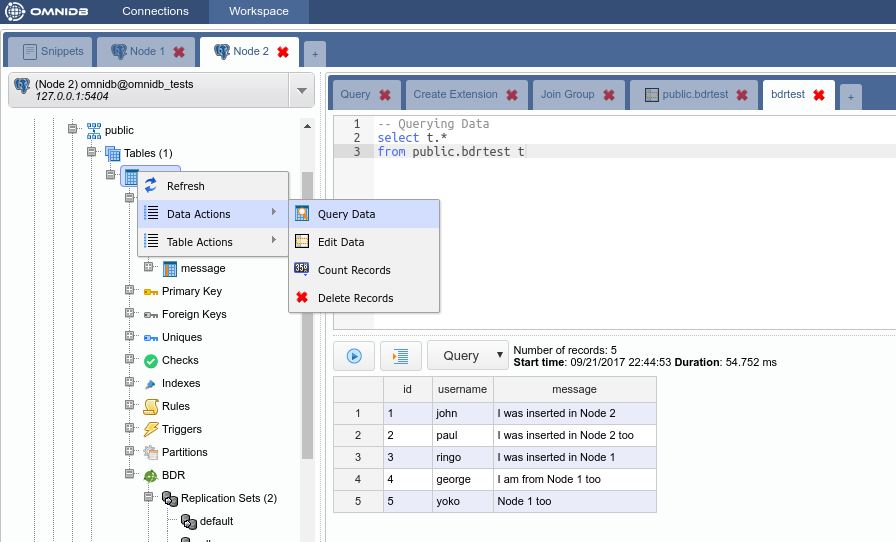

# Postgres-BDR with OmniDB

## 1. Introduction

[Postgres-BDR](https://www.2ndquadrant.com/en/resources/bdr/) (or just **BDR**,
for short) is an open source project from 2ndQuadrant that provides multi-master
features for PostgreSQL.

Here we will show how to build a test environment to play with BDR and how to
configure it using the OmniDB 2.1 web interface.

## 2. Building test environment

Let's build a 2-node test environment to illustrate how to configure BDR within
OmniDB.

### 2.1. Pull OmniDB repo

The first thing you need to do is to download OmniDB [repo from GitHub](https://github.com/OmniDB/OmniDB)
and make sure you are in the development branch. Run the following:

```bash
git clone https://github.com/OmniDB/OmniDB
cd OmniDB
git checkout dev
```

### 2.2. Create 2 virtual machines with BDR

On your host machine, you need to have installed:

- VirtualBox
- Vagrant
- Vagrant plugin vbguest

Please refer to [VirtualBox](https://www.virtualbox.org/) and
[Vagrant](https://www.vagrantup.com/) websites for more information.

For this test environment to work, you need to put both machines in the same
internal network. If necessary, please edit the file *Vagrantfile* for both
machines now, like this:

```
config.vm.network "private_network", ip: '192.168.56.103', :name => 'vboxnet0', :adapter => 2
```

Now on your terminal (assuming you are on the root directory of OmniDB repo), to
create the first virtual machine with BDR, you need to do:

```bash
cd OmniDB/OmniDB_app/tests/vagrant/multinode/bdr_node1
vagrant up
```

While inside this directory, you can connect via SSH to the machine with
`vagrant ssh`. User `vagrant` has root access with `sudo su`. Now let's create
the second virtual machine with BDR:

```bash
cd ../bdr_node2
vagrant up
```

You can connect to this machine via SSH the same way. Also, port 5432 of the
fist machine is mapped to the port 5403 of the host machine, and port 5432 of
the second machine is mapped to the port 5404 of the host machine. From the
host machine, you can connect to both virtual machines through OmniDB, using the
user `omnidb`.

## 3. Configuring BDR

### 3.1. Use OmniDB to connect to both machines

Assuming you have OmniDB (server or app) installed in your host machine, you
can connect to both databases in order to test the connection. In OmniDB, create
2 connections like this:


Then click on the *Test Connection* action on each connection. You will have to
type the password of the user `omnidb`, which is also `omnidb`.

### 3.2. Create required extensions

BDR requires 2 extensions to be installed on each database that should have
multi-master capabilities: `btree_gist` and `bdr`. Inside OmniDB, you can create
both extensions by right clicking on the *Extensions* node, and choosing the
action *Create Extension*. OmniDB will open a SQL template tab with the `CREATE
EXTENSION` command ready for you to make some adjustments and run:


You need to create both extensions `btree_gist` and `bdr` on both nodes.

### 3.3. Create the BDR group in the first node

With both extensions installed, you can refresh the root node of the OmniDB
tree view. A new *BDR* node will appear just inside your database. You can
expand this node to see some informations about BDR:


As you can see, BDR is not active yet. In the first node, we need to create a
*BDR group*. The other nodes will join this group later.

To create a BDR group, right click in the *BDR* node. In the SQL template,
adjust the node name and the node external connection info (the way other nodes
will use to connect to this node):


After you execute the above command, right click the *BDR* node and choose
*Refresh*. You will see that now BDR is active in this node, now called `node1`.
If you expand *Nodes*, you will see that this BDR group has only 1 node:


### 3.4. Join the BDR group in the second node

Now let's move to the other node. You can see that BDR is installed but not
active yet. To link the two nodes, we will need to make this node join the BDR
group that was previously created in the first node:


And now we can see that the second node has BDR active, his name in the BDR
group is `node2`, and now the BDR group has 2 nodes:


## 4. Testing BDR

### 4.1. Creating a table in the first node

Let's create a table in the first node. Expand the `public` schema, right click
the *Tables* node and choose *Create Table*. Give the new table a name and add
some columns. When done, click in the button *Save Changes*:


Now confirm that the table has been created in the first node by right clicking
the *Tables* node and choosing *Refresh*. Go to the second node, expand the
schema `public`, then expand the *Tables* node. Note that the table has been
replicated from `node1` to `node2`. If the table was created in the second node,
it would have been created in the first node as well, because in BDR all nodes
are masters.


### 4.2. Adding some data in the second node

While you are at the second node, right click the table `bdrtest`, point to
*Data Actions* and then click in *Edit Data*. Add some rows to this table. When
finished, click in the *Save Changes* button.


Now go to the first node, right click the table, point to *Data Actions* and
then click in *Query Data*. See how the rows created in `node2` were
automatically replicated into `node1`.


### 4.3. Adding some data in the first node

Let's repeat the same procedure above, but instead of inserting rows from the
second node, let's insert some rows while connected to the first node. Note how
they replicate into the second node in the same way.



