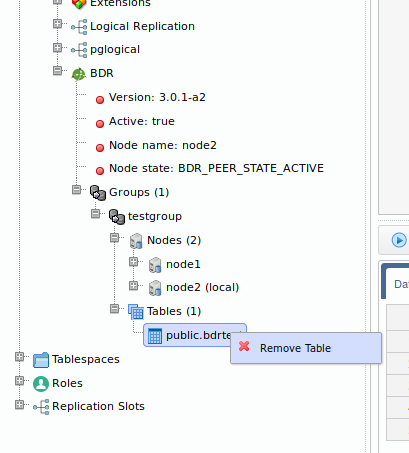

# Postgres-BDR 3.0 with OmniDB

## Introduction

OmniDB 2.8 introduced support for
[Postgres-BDR 3.0](https://www.2ndquadrant.com/en/resources/postgres-bdr-2ndquadrant/),
the ground-breaking multi-master replication tool for PostgreSQL databases,
announced last month in PostgresConf US.

Here we have 2 virtual machines with Postgres-BDR 3.0 installed and we will use
OmniDB to connect to them and setup replication between the machines.

## Pre-requisites

Postgres-BDR 3.0 requires PostgreSQL 10 or better and also pglogical 3.0
extension should be installed, as Postgres-BDR 3.0 works on top of pglogical
3.0. Make sure you put the required entries in `pg_hba.conf` to make both
machines communicate to each other via streaming replication. Then, in
`postgresql.conf` you should set the following parameters in both machines:

```text
listen_addresses = '*'
client_encoding = utf8
wal_level = 'logical'
track_commit_timestamp = on
max_wal_senders = 10
max_replication_slots = 10
max_worker_processes = 10
shared_preload_libraries = 'pglogical,bdr'
```

Then in both machines:

- Restart PostgreSQL
- Create a database (we are calling it `omnidb_tests`)
- In this database, create required extensions:

```sql
CREATE EXTENSION pglogical;
CREATE EXTENSION bdr;
```

## Connecting to both machines

We have installed OmniDB in the host machine and we also have included the
appropriate entries in the `pg_hba.conf` file for both virtual machines, to
allow connections from the host machine. Then in OmniDB, we need to create both
connections:


In the *Connection Grid*, click on the *Select Connection* green button to open
connections to both nodes as tabs. Then expand the *PostgreSQL* node, you will
see that we are using latest PostgreSQL minor release (currently 10.4). Then
expand the *Databases* node, *omnidb_tests* node and finally the *Extensions*
node to check the extensions that are installed in this database: `plpgsql`,
`pglogical` and `bdr`.

Now expand the `BDR` node to see some BDR properties about this node.


We can see that BDR version is *3.0.1-a2* and we didn't activate BDR in this
node yet. Also there are no *Groups* yet.

## Creating local BDR nodes

So far both machines have PostgreSQL 10, pglogical and bdr extensions installed,
but they are not yet BDR nodes. To make them BDR nodes, right-click the *BDR*
tree view node and click on the *Create Local Node* action. Change *node_name*
for a unique node name in the BDR cluster you are building. The second parameter
of the `bdr.create_node` function should be the connection string that other
nodes will use to connect to this node.

Do this for both machines. We will call the first machine "node1" and the second
machine "node2".


Once you executed the *Create Local Node* action, you can right-click on the
*BDR* tree view node and click on *Refresh*. Then you will see that BDR is not
active in this node yet, but the current node now has a name and a node state:
`BDR_PEER_STATE_CREATED`.


The current node state unlocks new actions to the tree view, as we can see
below.

## Creating a BDR group

Now that the current node is also a BDR node, you can see the following actions:


- *Create Group*: Creates a BDR replication group. The current node is
automatically joined to this group. Other nodes will be able to join this group
later;
- *Join Group*: Joins the current node to an existing BDR group that was
previously created in another node. It simply starts a background procedure that
may take several seconds to finish;
- *Join Group Wait*: After you executed the *Join Group* action, you can
execute this blocking action to wait for the current node to join the BDR group.

We will create a BDR group in the first node, then the second node will be able
to join it. So in "node1", use the *Create Group* action. It will need a group
name:


After you executed this action, right-click on the *BDR* tree view node and
click on *Refresh*. You will see that now BDR is fully activated in "node1"
which now has node state *BDR_PEER_STATE_ACTIVE*. The *Groups* tree view node is
now expandable and you can see that *testgroup* we just created has *node 1
(local)* in it.


## Joining a BDR group

Now we will make "node2" connect to the BDR group we just created. For that we
will use the *Join Group* action.


We need to fill the `join_target_dsn` parameter with the connection string to
a node that is already in the BDR group (in this case, "node1"). We also need to
write the name of the existing BDR group in the `node_group_name` parameter.

After amending the SQL text and executing it, wait for a few seconds and then
refresh the *BDR* tree view node again. If you are fast enough, you can see that
"node2" node state will change to `BDR_PEER_STATE_JOINING` and then become
`BDR_PEER_STATE_ACTIVE`, meaning that now both machines are connected and ready
to perform multi-master replication.


Right-clicking in a node of the group (except the local node) will show you the
action *Part Node*, which allows you to remove a remote node from the BDR group.
But we will not part any nodes now; we will continue demonstrating the BDR
multi-master replication.


## Creating a table in the first node

Let's create a table in the first node. Expand the `public` schema, right click
the *Tables* node and choose *Create Table*. Give the new table a name and add
some columns. When done, click in the button *Save Changes*:


Now confirm that the table has been created in the first node by right clicking
the *Tables* node and choosing *Refresh*. Go to the second node, expand the
schema `public`, then expand the *Tables* node. Note that the table has been
replicated from `node1` to `node2`. If the table was created in the second node,
it would have been created in the first node as well, because in BDR all nodes
are masters.

## Adding some data in the second node

While you are at the second node, right click the table `bdrtest`, point to
*Data Actions* and then click in *Edit Data*. Add some rows to this table. When
finished, click in the *Save Changes* button.


Now go to the first node, right click the table, point to *Data Actions* and
then click in *Query Data*. See how the rows created in `node2` were
automatically replicated into `node1`.


## Adding some data in the first node

Let's repeat the same procedure above, but instead of inserting rows from the
second node, let's insert some rows while connected to the first node. Note how
they replicate into the second node in the same way.


## Controling which tables should be replicated

By default, every new table created on any of the nodes will belong to the
replication group. All tables that belong to the group can be viewed in the
*Tables* tree view node, inside the BDR group. You can right click a table and
click on *Remove Table* to remove the table from the replication group. This way
the table won't be modified in any of the nodes, but it won't be replicated any
more. Then you can drop the table on one of the nodes and keep it in the other,
for example.



Similarly, the *Add Table* action allows you to add a table back to the
replication group.


