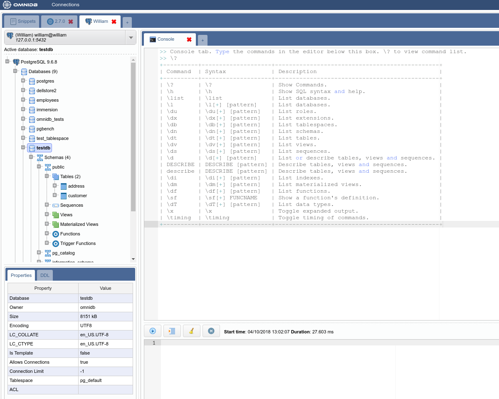
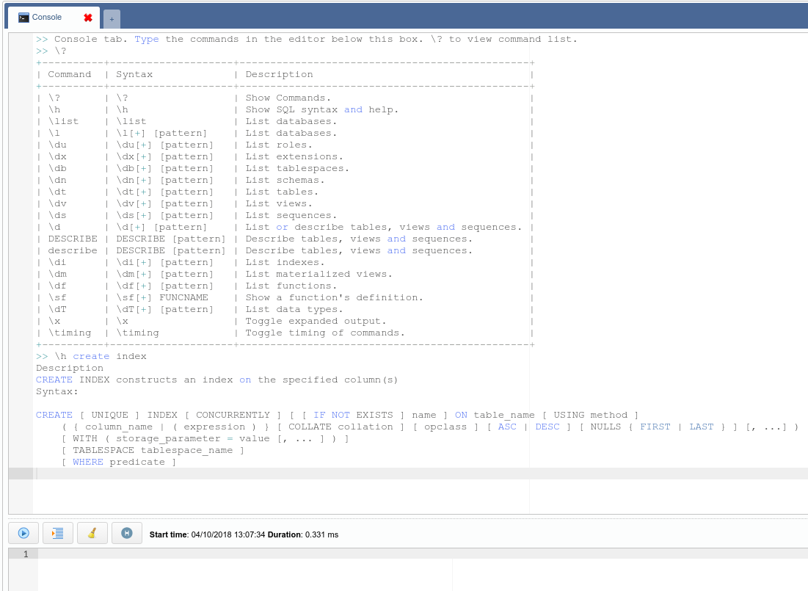
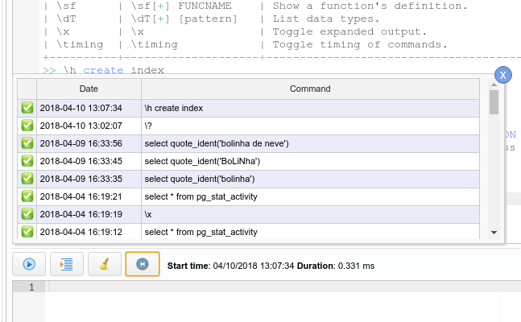
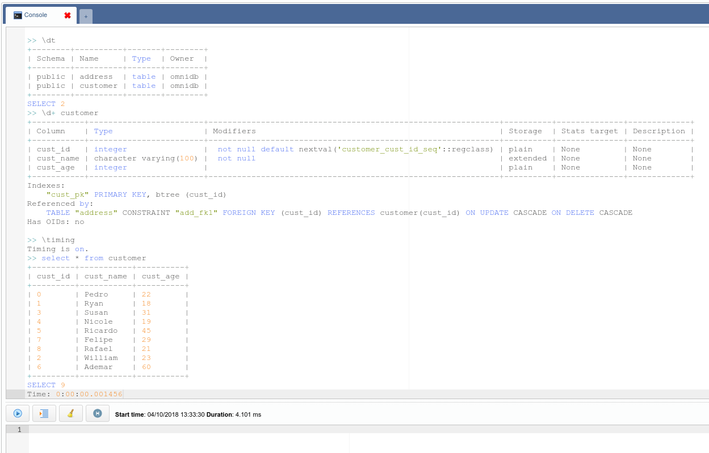
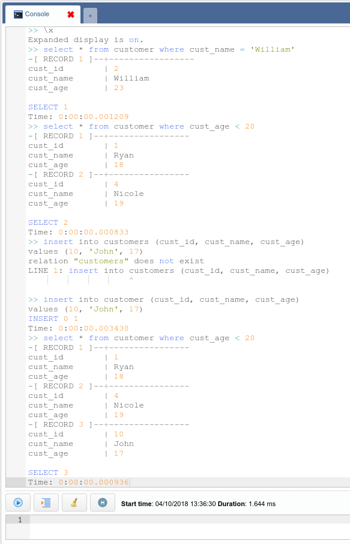

# Console Tab

Introduced in OmniDB 2.6.0, the new OmniDB Console Tab provides an easy and
confortable way to interact with your databases. Users familiar with the `psql`
command line utility will find that Console Tab behaves very similarly. In
fact, many of the backslash commands Console Tab provides are present in `psql`.

For example, `\?` shows a list with all commands available, its syntax and
description. The command `\h` can be another friend of yours, because it shows
a comprehensive help about any PostgreSQL SQL command.

The editor on the bottom of the tab area is full-featured just like the *Query
Tab* editor (it provides syntax highlight and autocomplete with *Ctrl-Space*).
To execute a command, just type it in this editor. If the command is a backslash
(starts with `\`), just type `Enter` and it will be executed. If it is a regular
SQL command, then it can be multi-lined, and you will need to type *Ctrl-Q* to
execute it.

All commands and its output will be logged into the display area, which is
textual and read-only, so you can copy and paste its contents somewhere else.
You can clear the display area by clicking on the *Clear Console* button.

All commands also are logged in the global OmniDB query history, and also in a
local console history, which you can by clicking in the *Command History*
button.

By clicking in the green check, you can borrow the command and put it into the
editor, so you can amend it and execute it. Another comfortable way to navigate
through the history is using the shortcuts *Ctrl-Up* and *Ctrl-Down*, to quickly
paste in the editor the previous and next commands, respectively.

Backslash commands such as `\dt`, `\d+`, `\x` and `\timing` are very useful when
dealing with databases every day. The console tab will also show any errors and
the results of any SQL command you type in a pretty way. Try it out!

In the near future we will add more commands such as `\copy` and also the
ability for the user to create custom commands. Stay tuned!
