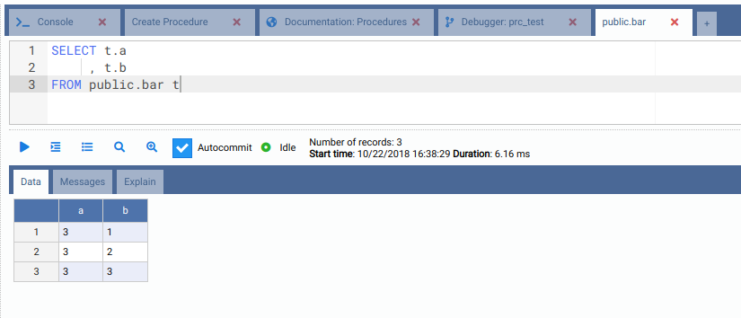
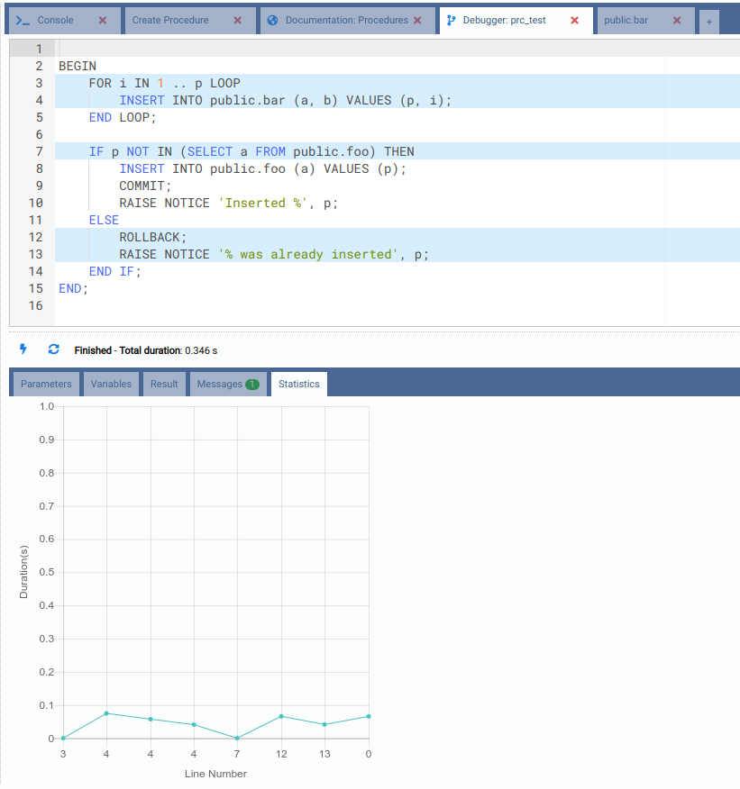

# OmniDB debugger for PostgreSQL 11

PostgreSQL 11 was released last week, with exciting new features. One of them
is the ability to write SQL procedures that can perform full transaction
management, enabling developers to create more advanced server-side
applications. SQL procedures can be created using the `CREATE PROCEDURE` command
and executed using the `CALL` command.

Since OmniDB 2.3.0 it is possible to debug PostgreSQL PL/pgSQL functions.
Support to PostgreSQL 11 functions and procedures was added in OmniDB 2.11.0.
Yesterday we released OmniDB 2.12.0 with nice new features and a new revamped
visual, so I'm going to show you how OmniDB 2.12.0 can debug PostgreSQL 11
procedures.

First of all, if you have not done that already, download and install a binary
PostgreSQL library called `omnidb_plugin` and enable it in PostgreSQL's config
file. The debugger also uses a special schema with special tables to control the
whole debugging process. This can be manually created or with an extension. For
more details on the installation, please refer to the
[instructions](https://github.com/OmniDB/OmniDB/blob/master/omnidb_plugin/README.md).
You can also refer to the
[documentation about the debugger](https://omnidb.org/en/documentation-en/13-debug-plpgsql-functions-en).

#### Creating some tables

For our tests, let's create 2 simple tables, `foo` and `bar`. Let's do that
using the OmniDB *Console Tab*:

```
CREATE TABLE public.foo (
    a INTEGER PRIMARY KEY
);

CREATE TABLE public.bar (
    a INTEGER,
    b INTEGER
)
```


#### Creating a procedure with transaction management

Note that OmniDB has a `Procedures` node in the tree view. Right-click on it,
then click on `Create Procedure`. It will open a *Query Tab* with a SQL template
showing basic SQL syntax to create a procedure.


If you want to know more about procedures, you can read online documentation
without leaving OmniDB. Simple click on `Procedures -> Doc: Procedures` and a
browser tab will be open for you already pointing to the documentation page:


Now let's go back to the *Create Procedure* tab and change the code to actually
create a procedure, like this:

```
CREATE OR REPLACE PROCEDURE public.prc_test
(
    p INTEGER
)
LANGUAGE plpgsql
AS
$procedure$
BEGIN
    FOR i IN 1 .. p LOOP
        INSERT INTO public.bar (a, b) VALUES (p, i);
    END LOOP;

    IF p NOT IN (SELECT a FROM public.foo) THEN
        INSERT INTO public.foo (a) VALUES (p);
        COMMIT;
        RAISE NOTICE 'Inserted %', p;
    ELSE
        ROLLBACK;
        RAISE NOTICE '% was already inserted', p;
    END IF;
END;
$procedure$
```

Once you click on *Run* or hit `Alt-Q`, the procedure will be compiled and
after refreshing the `Procedures` node, you will see the procedure we just
created:


#### Debugging a procedure with transaction management

To open the OmniDB debugger interface, right-click on the procedure and then
click on `Debug Procedure`.


Now fill the value of the parameter `p`, for example `3`. In this case, when
PostgreSQL executes the `COMMIT`, we will be able to see data in both tables
`foo` and `bar` even before the procedure finishes its execution.

Click on the lightning button to start debugging. The debugger will point its
cursor on the first command and you will be able to see all variables.


By clicking on the right arrow button (*Step Over*), you can watch PostgreSQL
executing statement by statement. You will see it performs an `INSERT` 3 times
on the table `bar`. But if you run a `SELECT` on this table, you will see it is
still empty.


Now advance the debugger until it performs the `COMMIT` statement, then try
fetching data from the `bar` table again.




The procedure did not finish its execution yet, but thanks to the ability of
the user to commit everything that was done so far, you are able to see data
from a different backend. Now advance the procedure until the end.


The procedure logic grants that data is not inserted in the `bar` table if `p`
already exists in the `foo` table. So let's start the debugger again with `p=3`
to see the `ROLLBACK` statement being executed:



