# PostgreSQL 10 Logical Replication with OmniDB

## 1. Introduction

Logical replication uses a publish/subscribe model and so we create publications
on the upstream (or publisher) and subscriptions on downstream (or subscriber).
For more details about it, please refer to
[this blog post](https://blog.2ndquadrant.com/logical-replication-postgresql-10/)
from my colleague Petr Jelinek, and also to the
[PostgreSQL](https://www.postgresql.org/docs/10/static/sql-createpublication.html)
[documentation](https://www.postgresql.org/docs/10/static/sql-createsubscription.html).

Here we will show how to build a test environment to play with this new feature
from PostgreSQL 10, and how to configure it using the OmniDB web interface.

## 2. Building test environment

Let's build a 2-node test environment to illustrate how to configure PG10
logical replication feature within OmniDB.

### 2.1. Pull OmniDB repo

The first thing you need to do is to download OmniDB [repo from GitHub](https://github.com/OmniDB/OmniDB)
and make sure you are in the development branch. Run the following:

```bash
git clone https://github.com/OmniDB/OmniDB
cd OmniDB
git checkout dev
```

### 2.2. Create 2 virtual machines with PostgreSQL 10

On your host machine, you need to have installed:

- VirtualBox
- Vagrant
- Vagrant plugin vbguest

Please refer to [VirtualBox](https://www.virtualbox.org/) and
[Vagrant](https://www.vagrantup.com/) websites for more information.

For this test environment to work, you need to put both machines in the same
internal network. If necessary, please edit the file *Vagrantfile* for both
machines now, like this:

```
config.vm.network "private_network", ip: '192.168.56.101', :name => 'vboxnet0', :adapter => 2
```

Now on your terminal (assuming you are on the root directory of OmniDB repo), to
create the first virtual machine with PostgreSQL 10, you need to do:

```bash
cd OmniDB/OmniDB_app/tests/vagrant/multinode/pg10_node1
vagrant up
```

While inside this directory, you can connect via SSH to the machine with
`vagrant ssh`. User `vagrant` has root access with `sudo su`. Now let's create
the second virtual machine with PostgreSQL 10:

```bash
cd ../pg10_node2
vagrant up
```

You can connect to this machine via SSH the same way. Also, port 5432 of the
fist machine is mapped to the port 5401 of the host machine, and port 5432 of
the second machine is mapped to the port 5402 of the host machine. From the
host machine, you can connect to both virtual machines through OmniDB, using the
user `omnidb`.

# 3. Configuring logical replication

## 3.1. Set PostgreSQL parameter `wal_level`

You need to connect to each machine and set `wal_level = logical`. For the first
machine, assuming you are on the root folder of OmniDB:

```
user@host:~$ cd OmniDB/OmniDB_app/tests/vagrant/multinode/pg10_node1
user@host:~$ vagrant ssh
vagrant@omnidb1:~$ sudo su
root@omnidb1:/home/vagrant# echo "wal_level = logical" >> /etc/postgresql/10/main/postgresql.conf
root@omnidb1:/home/vagrant# systemctl restart postgresql
```

Now do the same for the other machine.

## 3.2. Use OmniDB to connect to both machines

Assuming you have OmniDB (server or app) installed in your host machine, you
can connect to both databases in order to test the connection. In OmniDB, create
2 connections like this:

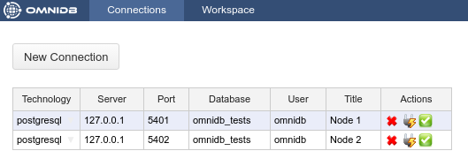

Then click on the *Test Connection* action on each connection. You will have to
type the password of the user `omnidb`, which is also `omnidb`.

## 3.3. Create a test table on both machines

Connect to both databases and create a test table, like this:

```
CREATE TABLE customers (
 login text PRIMARY KEY,
 full_name text NOT NULL,
 registration_date timestamptz NOT NULL DEFAULT now()
)
```

Using OmniDB, it would look like this:

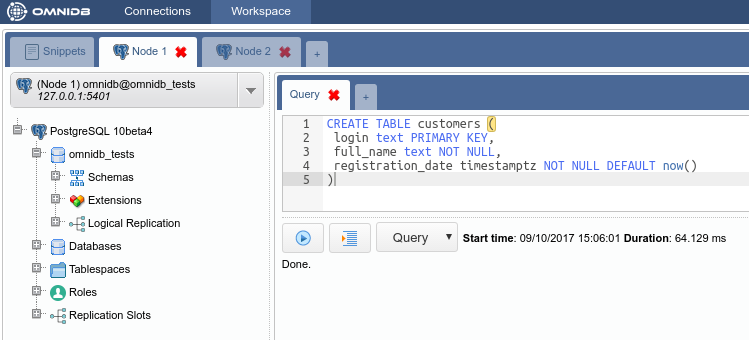

## 3.4. Create a publication on the first machine

Inside the connection node, expand the *Logical Replication* node, then right
click in the *Publications* node, and choose the action *Create Publication*.
OmniDB will open a SQL template tab with the `CREATE PUBLICATION` command ready
for you to make some adjustments and run:

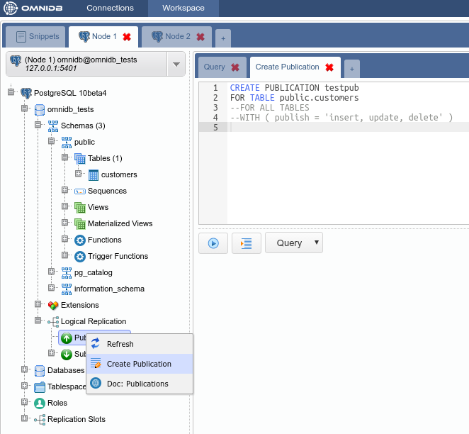

After adjusting and executing the command, you can right click the *Publications*
node again and click on the *Refresh* action. You will see that will be created
a new node with the same name you gave to the publication. Expanding this node,
you will see the details and the tables for the publication:

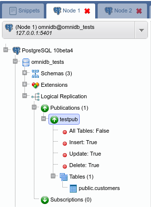

## 3.5. Create a subscription on the second machine

Inside the connection node, expand the *Logical Replication* node, then right
click in the *Subscriptions* node, and choose the action *Create Subscription*.
OmniDB will open a SQL template tab with the `CREATE SUBSCRIPTION` command ready
for you to make some adjustments and run:

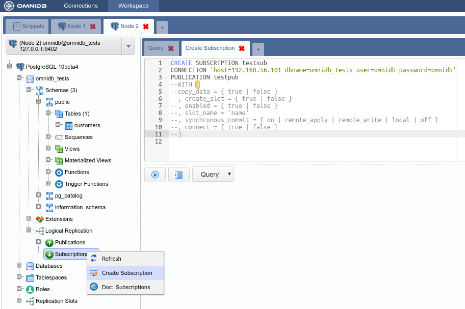

After adjusting and executing the command, you can right click the *Subscriptions*
node again and click on the *Refresh* action. You will see that will be created
a new node with the same name you gave to the subscription. Expanding this node,
you will see the details, the referenced publications and the tables for the
subscription:

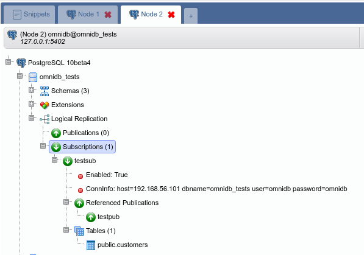

Also, the `CREATE SUBSCRIPTION` command created a *logical replication slot*
called `testsub` (the same name as the subscription) in the first machine:

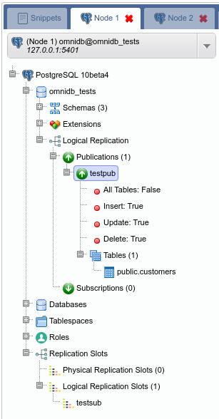

# 4. Testing the logical replication

So far we created:

- Table `public.customers` on both nodes 1 and 2
- Publication `testpub` for table `public.customers` on node 1
- Subscription `testsub` on node 2, referencing publication `testpub`

To test the replication is working, let's create some data on the node 1. Right
click on the table `public.customers`, then point to *Data Actions*, then click
on the action *Edit Data*. In this grid, you are able to add, edit and remove
data from the table. Add 2 sample rows, like this:

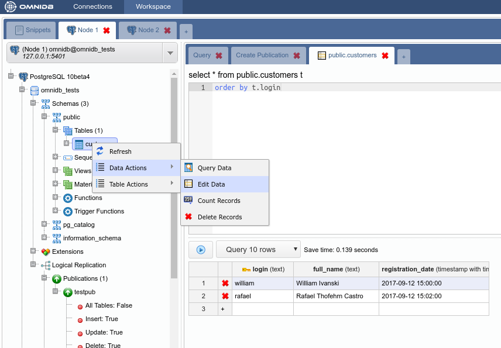

Then, on the other node, check if the table `public.customers` was automatically
populated. Right click on the table `public.customers`, then point to *Data
Actions*, then click on the action *Query Data*:

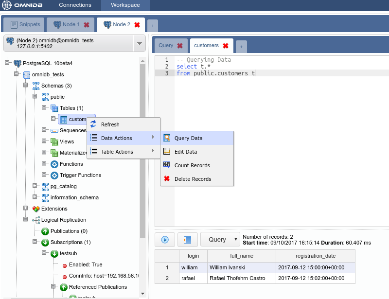

As we can see, both rows created in the first machine were replicated into the
second machine. This tell us that the logical replication is working. And it
was configured using the OmniDB web interface.

# 5. More features

Right clicking on the publication or the subscription, shows the *Alter* and the
*Drop* actions:

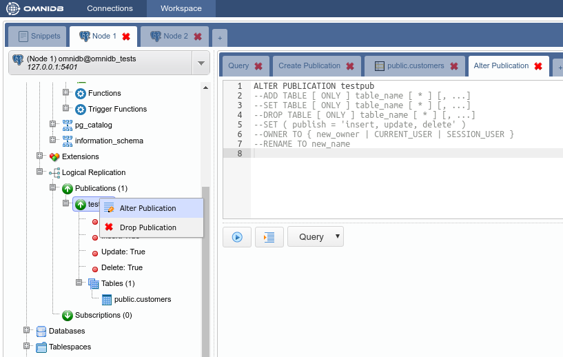

You can also add and remove tables from a publication:

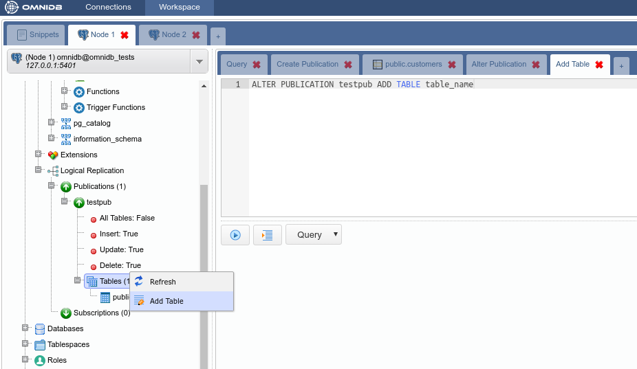

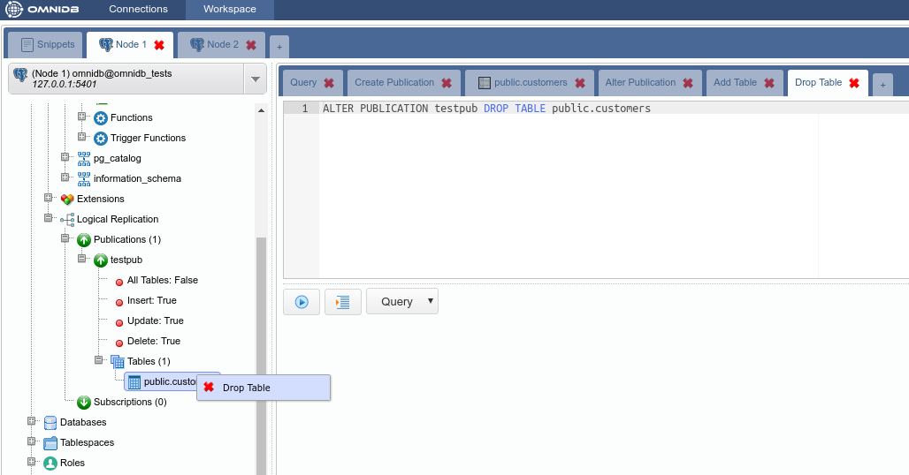
