# OmniDB: Monitoring Dashboard

OmniDB 2.4.0 introduces a new cool feature called *Monitoring Dashboard*. We
know a picture is worth a thousand words, so please take a look:

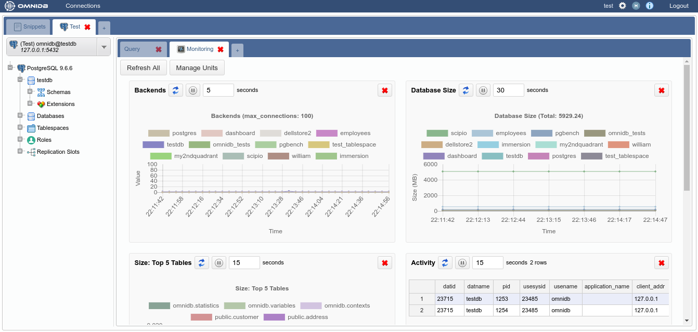

As you can see, this is a new kind of inner tab showing some charts and grids.
This *Monitoring* inner tab is automatically opened once you expand the tree
root node (the *PostgreSQL* node). You can keep it open or close it at any time.
To open it again, right-click the root node and click on *Dashboard*.

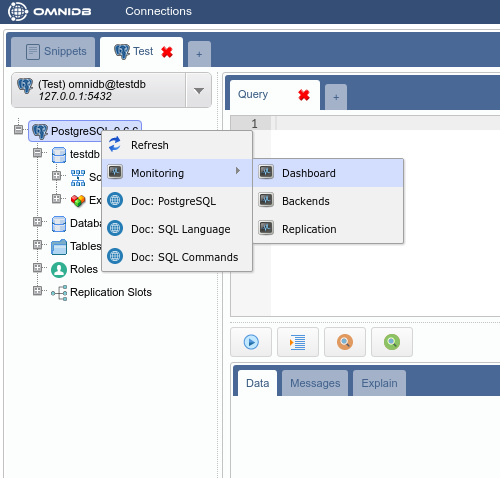

The dashboard is composed of handy information rectangles called *Monitoring
Units*. Currently there are 3 types of Monitoring Units:

- **Grid**: The most simple kind, just executes a query from time to time and
shows the results in a data grid.

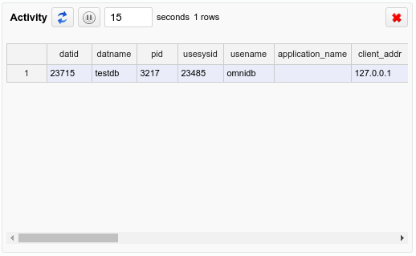

- **Chart**: Every time it refreshes, it renders a new complete chart. The old
set of values is lost. This is most useful for pie charts, but other kind of
charts can be used too.

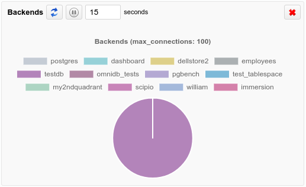

- **Chart-Append**: Perhaps this is the most useful kind of Monitoring Unit.
It is a chart that appends a new set of values every time it refreshes. Line or
bar charts fit best for this type. The last 50 set of values are kept by the
component client-side to be viewed by the user.

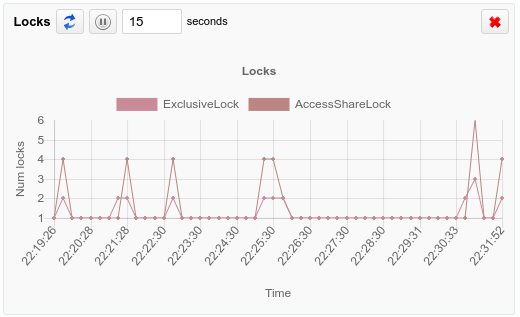

If you click in the button *Refresh All*, then all Monitoring Units will be
refreshed at once. You can also remove undesired Monitoring Units by clicking in
the *Remove* button. To add units to the Dashboard, click on the *Manage Units*
button, and then click on the green action to add the Monitoring Unit you
choose. This way, you can add and remove any unit you want to customize the
dashboard the way you want.

## Writing custom Monitoring Units

OmniDB provides you the power to write your own units and customize existing
ones. Everything is done through Python scripts that run inside a sandbox. To
create a new Monitoring Unit, click on the *Manage Units* button in the
dashboard, then click on the *New Unit* button. It will open a new kind of inner
tab like this:

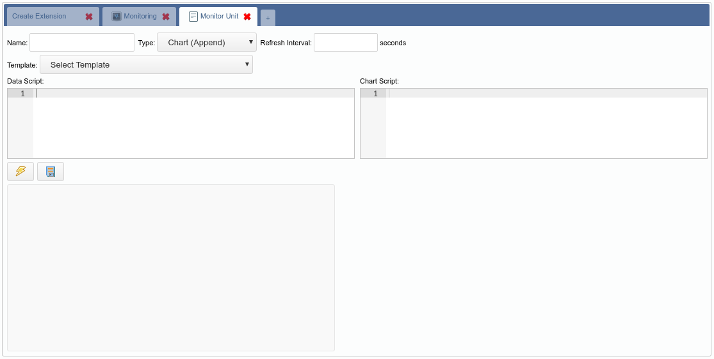

The easiest way to write a custom unit is to use an existing one as template. Go
ahead and select the *(Chart) Database Size* template:

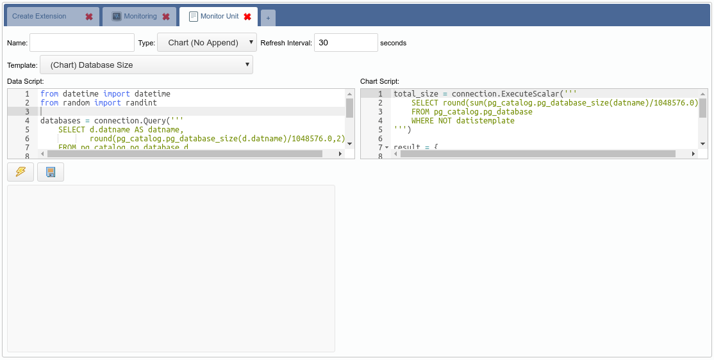

You can find a more detailed explanation about each script in
[OmniDB documentation](https://omnidb.org/en/documentation-en/14-monitoring-dashboard-en).
For now, keep in mind that there are two scripts:

- **Data Script**: Executed every time the unit is refreshed;
- **Chart Script**: Executed only at the beginning to build the chart.

Let us take a look at the **Data Script**. This template is for a Pie chart. So
right now you are probably guessing that you just need to change the SQL query
to make the chart behave different. Well, in terms of data and datasets, you
guessed right. So let's change the SQL query of this chart to compare sizes of
tables of schema `public`. Also change the references from `datname` to
`tablename`, as we have changed the column name.

```python
from datetime import datetime
from random import randint

databases = connection.Query('''
    SELECT c.relname as tablename,
           round(pg_catalog.pg_total_relation_size(c.oid)/1048576.0,2) AS size
    FROM pg_catalog.pg_class c
    INNER JOIN pg_catalog.pg_namespace n
    ON n.oid = c.relnamespace
    WHERE n.nspname = 'public'
      AND c.relkind = 'r'
''')

data = []
color = []
label = []

for db in databases.Rows:
    data.append(db["size"])
    color.append("rgb(" + str(randint(125, 225)) + "," + str(randint(125, 225)) + "," + str(randint(125, 225)) + ")")
    label.append(db["tablename"])

result = {
    "labels": label,
    "datasets": [
        {
            "data": data,
            "backgroundColor": color,
            "label": "Dataset 1"
        }
    ]
}
```

Copy and paste the above script into the *Data Script* field and then hit the
*Test* button:

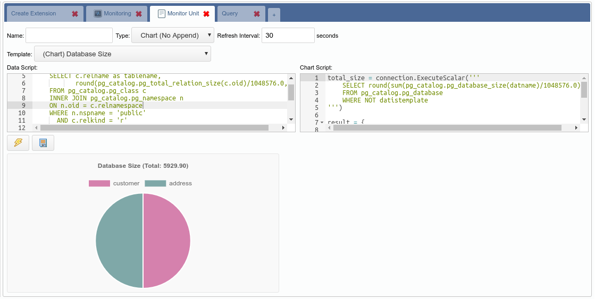

Apparently the chart is almost done. We need to fix the title, it still says
*Database Size*, when this chart is about table size. Any information about the
format of the chart itself is defined in the *Chart Script* text field. So we
just need to change the query and adjust the title, this way:

```python
total_size = connection.ExecuteScalar('''
    SELECT round(sum(pg_catalog.pg_total_relation_size(c.oid)/1048576.0),2) AS size
    FROM pg_catalog.pg_class c
    INNER JOIN pg_catalog.pg_namespace n
    ON n.oid = c.relnamespace
    WHERE n.nspname = 'public'
      AND c.relkind = 'r'
''')

result = {
    "type": "pie",
    "data": None,
    "options": {
        "responsive": True,
        "title":{
            "display":True,
            "text":"Table Size (Total: " + str(total_size) + ")"
        }
    }
}
```

Copy and paste the above Python code into the *Chart Script*. Then click in the
*Test* button:

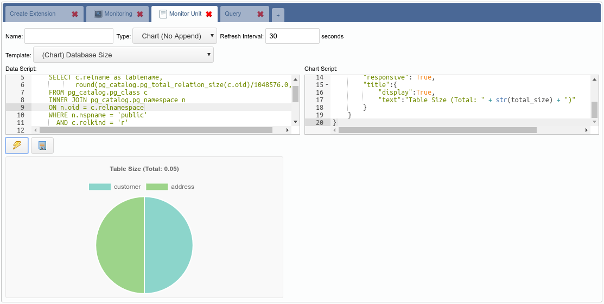

Now that the chart finally works the way we want, we can give it a title, adjust
the refresh interval and then click in the *Save* button. After that we can add
it to the dashboard.

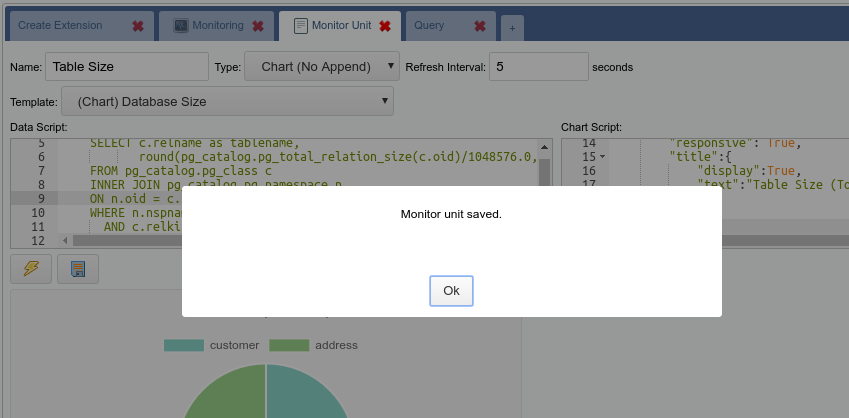

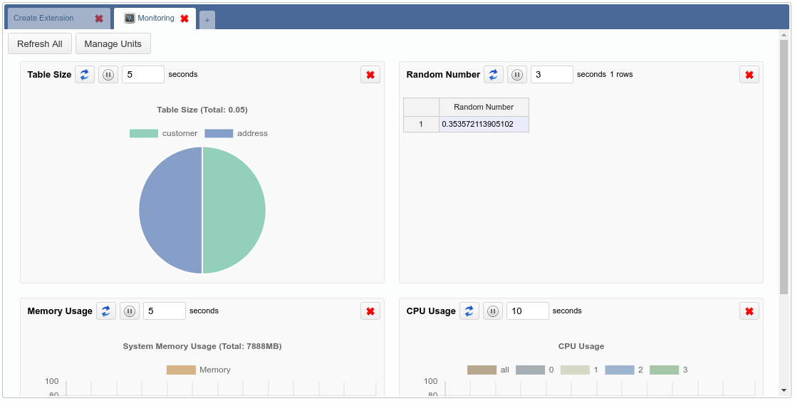

All Monitoring Units that come with OmniDB are open source and available in this
[repository](https://github.com/OmniDB/monitors) (feel free to contribute).

Stay tuned for the next big monitoring feature: **Persistent Monitoring**!
