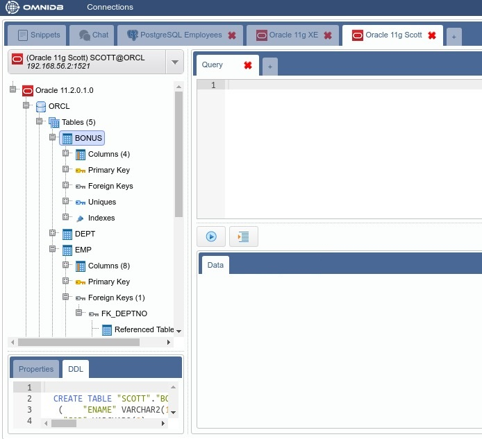
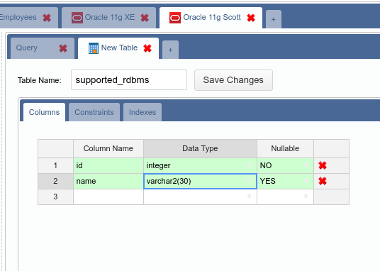
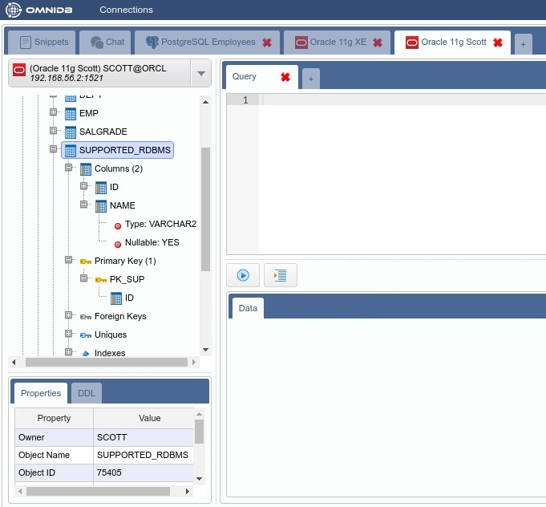

# Oracle with OmniDB

OmniDB was designed to allow users to manage multiple databases from different
RDMBS within an unified workspace. The philosophy is to use the same familiar
web interface (same structures, icons, context menu and handy features such as
*SQL Autocomplete*, *Create/Edit Table Form* and *Edit Data*) so the user feels
comfortable and confident to manage different systems as if they are just
different connections from the same system.

OmniDB 2.5.0 introduces basic support to Oracle databases. Users can connect and
interact with Oracle databases the same way the tool already does for PostgreSQL
databases. Oracle versions 11g and 12c are supported.

## Let's connect to Oracle databases

As you can see below, I already have some OmniDB connections. Now let's connect
to Oracle right away, click on *New Connection*. PostgreSQL is the default
technology, you will have to choose *oracle*:

Fill the connection settings and click in the *Test Connection* action:

You will see an image saying the logon was denied:

This behavior is similar to how OmniDB handles PostgreSQL connections. To
improve security, OmniDB does not keep the database password in some
configuration file, it keeps it encrypted and in memory. If the user don't
perform any action against the database for a pre-defined amount of time, the
password expires and user has to type it again.

As this is the first time we are trying to connect to this Oracle database,
OmniDB does not have the password in memory yet. So OmniDB asks the user. After
we type the password and hit *Enter* or the *OK* button, the connection test
passes:

Before checking what is inside this database, why not opening another Oracle
connections to other servers? You already know how to do it:

## Let's manage Oracle databases

As mentioned above, OmniDB allows you to manage multiple PostgreSQL and Oracle
databases within the same unified workspace. The *Connection Selector* feature
allows you to easily switch among the connections we previously configured:

Now that we have selected the connection to *Oracle 11g XE*, let's click on the
root node of the treeview to expand it. Note how OmniDB detects the exact
version of the server and shows a treeview structure very similar to the one
you see when managing PostgreSQL databases:

OmniDB hides the *Databases* tree node, because in Oracle XE (*Express Edition*)
there is only one database called *XE*.

As we are connected to this *XE* database as user *SYSTEM*, we have privileges
to view and manage *Oracle Sessions*. Right-click the root node, move the
pointer to *Monitoring* and then click on *Sessions*:

You can also kill a session by right-clicking on the *X* action of the session
(beware that this may have undesired collateral effects, make sure you know what
you are doing!). A confirmation popup will appear:

## The Oracle user SCOTT

Oracle 11g comes with an user called *SCOTT* (password *tiger*) just for
demonstration purposes. This user is disabled by default. Also, in Oracle, an
user is associated with an specific schema, which contains the database objects
it owns.

Let's connect to this Oracle 11g server, using the *scott* credentials we
informed when we created this connection in the *Connection Grid*. In the
following images you can see that *scott* already owns 5 tables, and by clicking
on each of them you can see its properties and DDL SQL (which can be copied).
Also, by expanding each table, you can navigate through its elements.

## Managing tables and data

OmniDB table creation and edition form works with Oracle too. To open it, just
right-click in the *Tables* tree node and click in *Create Table*:

Choose a name for the new table, some fields and also create a primary key. When
finished, click on *Save Changes*. Right-click the *Tables* and click *Refresh*
to see the new table in the treeview. By clicking on the table, you will see
properties and DDL SQL for it too.

OmniDB also allows you to manage data in a comfortable spreadsheet-like grid.
Right-click our new table and move the pointer to *Data Actions* then click on
*Edit Data*:

Let's include some records. When finished, click on *Save Changes*:

Remember that in the same grid you can edit records and delete them by right-
clicking on the *X* action.

## Executing queries

When connected to Oracle databases, in the *Query Tab*, you can benefit from the
same familiar and comfortable SQL editor with SQL syntax highlight, autocomplete
for columns of tables and subqueries and *Find & Replace* feature. The query
results will be shown in a grid. You can see all these features in the images
below.

For queries that return many records, only the first 50 records are shown. In
this case, handy buttons *Fetch More* and *Fetch All* will appear. For long-
running queries, a *Cancel* button will also appear. And of course, you can have
several tabs open and executing queries in several databases. If the long-
running query is not selected, a green icon will appear on its header when the
query has finished executing.

## Other familiar features

Several other well-known OmniDB features also work with Oracle databases. For
example, the table relationship graphs (simple and complete), *SQL History* and
*SQL Templates*.

