# pglogical with OmniDB

## 1. Introduction

[pglogical](https://www.2ndquadrant.com/en/resources/pglogical/) is an extension
that provides an advanced logical replication system that serves as a highly
efficient method of replicating data as an alternative to physical replication.

Here we will show how to build a test environment to play with PostgreSQL and
pglogical, and how to configure it using the OmniDB 2.2 web interface.

## 2. Building test environment

Let's build a 2-node test environment to illustrate how to configure PostgreSQL
and pglogical within OmniDB.

### 2.1. Pull OmniDB repo

The first thing you need to do is to download OmniDB [repo from GitHub](https://github.com/OmniDB/OmniDB)
and make sure you are in the development branch. Run the following:

```bash
git clone https://github.com/OmniDB/OmniDB
cd OmniDB
git checkout dev
```

### 2.2. Create 2 virtual machines with PostgreSQL and pglogical

On your host machine, you need to have installed:

- VirtualBox
- Vagrant
- Vagrant plugin vbguest

Please refer to [VirtualBox](https://www.virtualbox.org/) and
[Vagrant](https://www.vagrantup.com/) websites for more information.

For this test environment to work, you need to put both machines in the same
internal network. If necessary, please edit the file *Vagrantfile* for both
machines now, like this:

```
config.vm.network "private_network", ip: '192.168.56.108', :name => 'vboxnet0', :adapter => 2
```

Now on your terminal (assuming you are on the root directory of OmniDB repo), to
create the first virtual machine with PostgreSQL and pglogical, you need to do:

```bash
cd OmniDB/OmniDB_app/tests/vagrant/multinode/pglogical_node1
vagrant up
```

While inside this directory, you can connect via SSH to the machine with
`vagrant ssh`. User `vagrant` has root access with `sudo su`. Now let's create
the second virtual machine with PostgreSQL and pglogical:

```bash
cd ../pglogical_node2
vagrant up
```

You can connect to this machine via SSH the same way. Also, port 5432 of the
fist machine is mapped to the port 5408 of the host machine, and port 5432 of
the second machine is mapped to the port 5409 of the host machine. From the
host machine, you can connect to both virtual machines through OmniDB, using the
user `omnidb`.

# 3. Configuring pglogical

## 3.1. Use OmniDB to connect to both machines

Assuming you have OmniDB (server or app) installed in your host machine, you
can connect to both databases in order to test the connection. In OmniDB, create
2 connections like this:

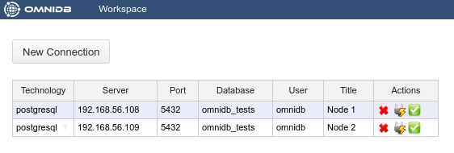

Then click on the *Test Connection* action on each connection. You will have to
type the password of the user `omnidb`, which is also `omnidb`.

## 3.2. Create pglogical extension in both nodes

pglogical requires an extension to be installed in both nodes. Inside OmniDB,
you can create the extension by right clicking on the *Extensions* node, and
choosing the action *Create Extension*. OmniDB will open a SQL template tab with
the `CREATE EXTENSION` command ready for you to make some adjustments and run:

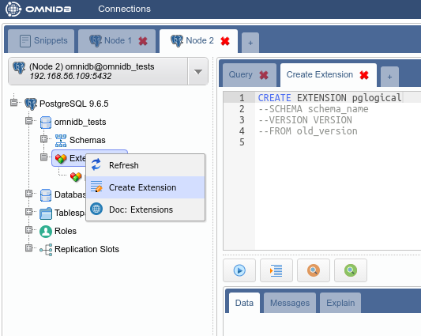

After you have created the extension, you need to refresh the root node of the
treeview, by right-clicking on it and choosing *Refresh*. Then you will see that
OmniDB already acknowledges the existence of pglogical in this database.
However, pglogical is not active yet.

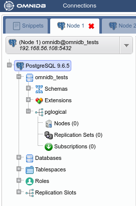

## 3.3. Create pglogical nodes

To activate pglogical in this database, we need to create a pglogical node on
each machine. Inside the *pglogical* node of the treeview, right click *Nodes*,
then choose *Create Node*. In the SQL template that will open, adjust the node
name and the DSN and run the command.

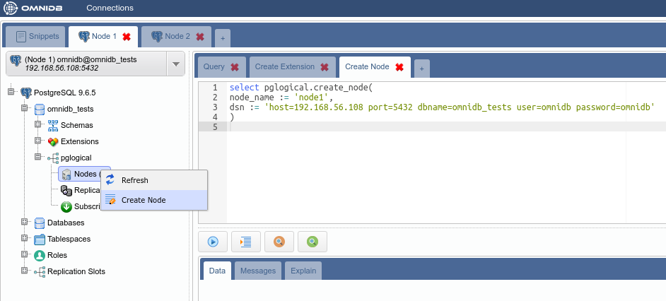

Then right click *Nodes* again, but this time choose *Refresh*. You will see
the node you just created. Note how OmniDB understands that this node is local.
Expand the local node to see its interface inside. You can manage the interfaces
of the nodes using OmniDB too.

Go ahead and expand the *Replication Sets* node. You can see pglogical default
replication sets are already created: *ddl_sql*, *default* and *default_insert_only*.
You can also manage replication sets using OmniDB.

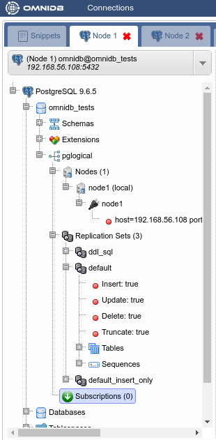

Now create a node on the other machine too. Choose a different name for the node.

## 3.4. Create a table on the first machine

In the first machine, under the *Schemas* node, expand the *public* node, then
right-click the *Tables* node and choose *Create Table*. In the form tab that
will open, give the new table a name and some columns. Also add a primary key in
the *Constraints* tab. When done, click in the *Save Changes* button.

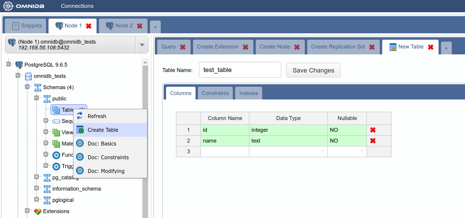

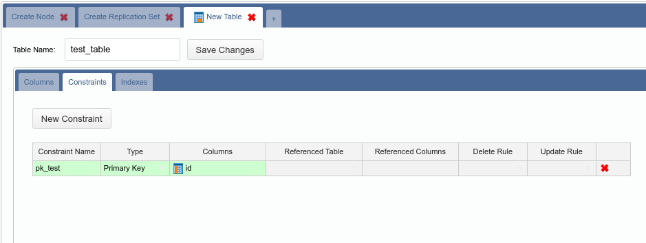

## 3.5. Add the new table to a replication set on the first machine

In the first machine, under the *default_insert_only* replication set, right
click the *Tables* node and choose *Add Table*. In the SQL template tab that
will open, change the table name in the *relation* argument and then execute the
command.

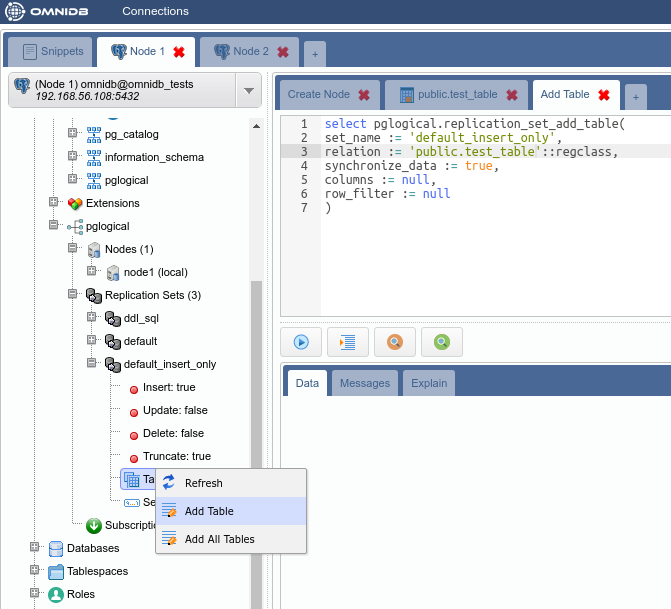

Refresh the *Tables* node to check the table was added to the replication set.

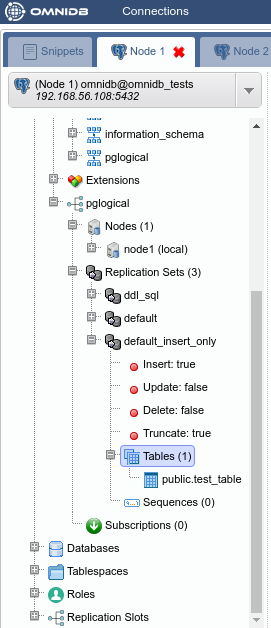

## 3.6. Add a subscription on the second machine

In the second machine, right-click the *Subscriptions* node and choose *Create
Subscription*. In the SQL template tab that will open, change DSN of the first
machine and then execute the command.

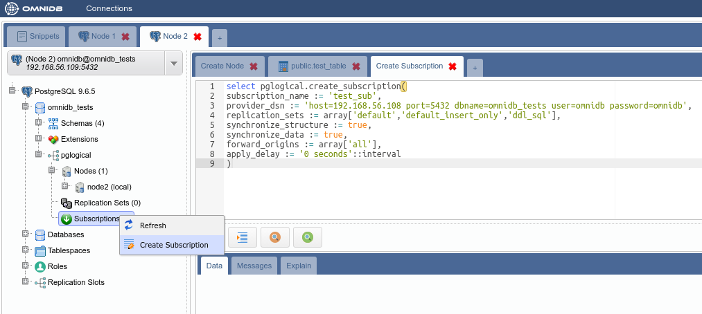

Refresh and expand both *Nodes* and *Subscriptions* nodes of the treeview. Note
how now the second machine knows about the first machine. Also check the
information OmniDB shows about the subscription we just created.

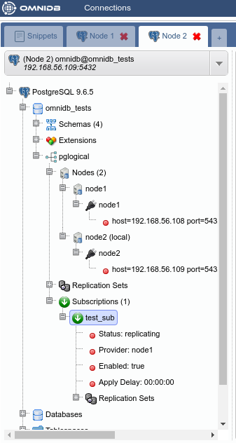

Also verify that the table *public.test_table* was created automatically in the
second machine:

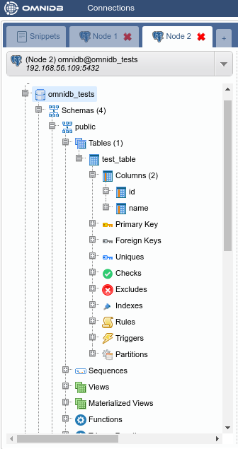

## 3.7. Add some data in the table on the first machine

In the first machine, under the *Schemas* node, expand the *public* node and
the *Tables* node. Right-click in our table, *test_table*, move the mouse
pointer to *Data Actions* and then click on *Edit Data*. Insert some data to the
table. When finished, click on the *Save Changes* button.

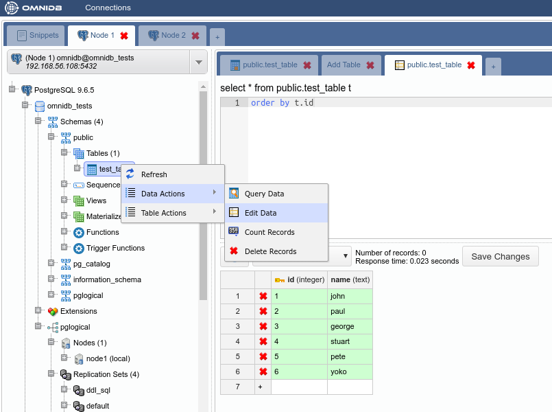

Now let us check the data was replicated. Go to the second machine and
right-click the table, move the mouse pointer to *Data Actions* and then click
on *Query Data*.

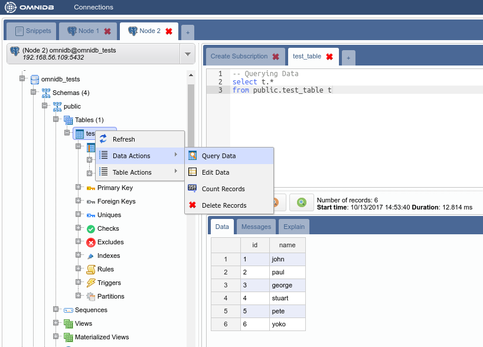

## 3.8. Check if delete is being replicated

In the *Edit Data* tab in the first machine, remove Pete and Stuart. Click on
the button *Save Changes* when done.

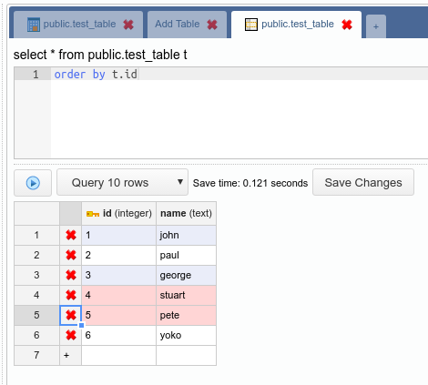

Check if these 2 rows were deleted in the second machine.

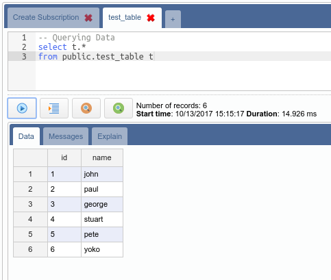

They were not removed in the second machine because the table *public.test_table*
is in the replication set *default_insert_only*, that does not replicate *updates*
and *deletes*.
