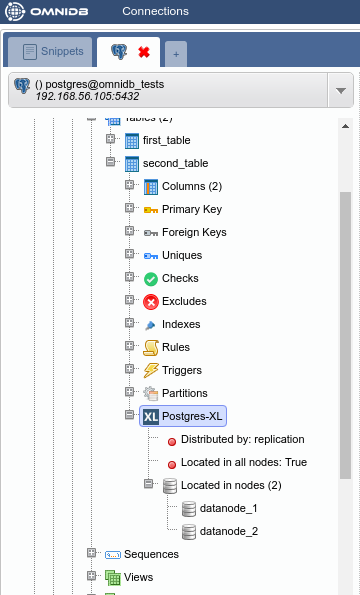

# Postgres-XL with OmniDB

## 1. Introduction

[Postgres-XL](https://www.2ndquadrant.com/en/resources/postgres-xl/) (or just
**XL**, for short) is an open source project from 2ndQuadrant. It is a massively
parallel database built on top of PostgreSQL, and it is designed to be
horizontally scalable and flexible enough to handle various workloads.

Here we will show how to build a test environment to play with XL and how to
configure it using the OmniDB 2.2 web interface.

## 2. Building test environment

In this experiment, we will build a cluster with 1 GTM, 1 coordinator and 2
data nodes. It would be simpler to put them in the same virtual machine, however
split them across multiple virtual machines is a more realistic scenario. So
we will build 3 virtual machines:

| Machine | IP | Role |
|---|---|---|---|
| xl_gtmcoord | 192.168.56.105 | GTM and coordinator |
| xl_datanode1 | 192.168.56.106 | data node |
| xl_datanode2 | 192.168.56.107 | data node |

For this test environment to work, you need to put both machines in the same
internal network. If necessary, you can edit IP addresses in files *Vagrantfile*
and *bootstrap.sh* located inside the folder of each machine.

### 2.1. Pull OmniDB repo

The first thing you need to do is to download OmniDB [repo from GitHub](https://github.com/OmniDB/OmniDB)
and make sure you are in the development branch. Run the following:

```bash
git clone https://github.com/OmniDB/OmniDB
cd OmniDB
git checkout dev
```

### 2.2. Creating virtual machines

On your host machine, you need to have installed:

- VirtualBox
- Vagrant
- Vagrant plugin vbguest

Please refer to [VirtualBox](https://www.virtualbox.org/) and
[Vagrant](https://www.vagrantup.com/) websites for more information.

If necessary, please edit the file *Vagrantfile* for all machines now, like this:

```
config.vm.network "private_network", ip: '192.168.56.105', :name => 'vboxnet0', :adapter => 2
```

You also will need to replace the IP addresses on the file *bootstrap.sh* for
all machines.

On your terminal (assuming you are on the root directory of OmniDB repo), to
create the first virtual machine with XL, you need to do:

```bash
cd OmniDB/OmniDB_app/tests/vagrant/multinode/xl_gtmcoord
vagrant up
```

Please note that this may take a while to finish. It will perform the following
tasks automatically:

- Download vagrant box for Debian 9 (if not present)
- Start the virtual machine based on the box
- Download updates
- Clone Postgres-XL repo
- Compile Postgres-XL
- Instantiate and start the node

Go ahead and create the other 2 virtual machines:

```bash
cd ../xl_datanode1
vagrant up
cd ../xl_datanode2
vagrant up
```

## 3. Creating nodes

At this point all machines are up and running a Postgres-XL node on each one of
them. But the nodes does not know about each other. Besides, every node thinks
it is a coordinator. So we need to connect to each node, alter its type and
inform it about the existence of the other nodes.

### 3.1. xl_gtmcoord

```bash
cd OmniDB/OmniDB_app/tests/vagrant/multinode/xl_gtmcoord
vagrant ssh
```

```bash
sudo su
su postgres
psql -c "ALTER NODE coord1 WITH (TYPE = 'coordinator', HOST = 'localhost', PORT = 5432)"
psql -c "CREATE NODE datanode_1 WITH (TYPE = 'datanode', HOST = '192.168.56.106', PORT = 5432)"
psql -c "CREATE NODE datanode_2 WITH (TYPE = 'datanode', HOST = '192.168.56.107', PORT = 5432)"
psql -c "SELECT pgxc_pool_reload()"
```

### 3.2. xl_datanode1

```bash
cd ../xl_datanode1
vagrant ssh
```

```bash
sudo su
su postgres
psql -c "ALTER NODE datanode_1 WITH (TYPE = 'datanode', HOST = 'localhost', PORT = 5432)"
psql -c "CREATE NODE coord1 WITH (TYPE = 'coordinator', HOST = '192.168.56.105', PORT = 5432)"
psql -c "CREATE NODE datanode_2 WITH (TYPE = 'datanode', HOST = '192.168.56.107', PORT = 5432)"
psql -c "SELECT pgxc_pool_reload()"
```

### 3.3. xl_datanode2

```bash
cd ../xl_datanode2
vagrant ssh
```

```bash
sudo su
su postgres
psql -c "ALTER NODE datanode_2 WITH (TYPE = 'datanode', HOST = 'localhost', PORT = 5432)"
psql -c "CREATE NODE coord1 WITH (TYPE = 'coordinator', HOST = '192.168.56.105', PORT = 5432)"
psql -c "CREATE NODE datanode_1 WITH (TYPE = 'datanode', HOST = '192.168.56.106', PORT = 5432)"
psql -c "SELECT pgxc_pool_reload()"
```

## 4. Playing with XL

Finally we have a working Postgres-XL cluster. And it is very nice, because
there are separated virtual machines for each data node.

### 4.1. Connecting to the cluster with OmniDB

In order to connect to the cluster with OmniDB, we need to connect to the
coordinator and change the password of the user *postgres*. And let us also
create a new database:

```bash
cd OmniDB/OmniDB_app/tests/vagrant/multinode/xl_gtmcoord
vagrant ssh
```

```bash
sudo su
su postgres
psql -c "ALTER USER postgres WITH PASSWORD 'omnidb'"
psql -c "CREATE DATABASE omnidb_tests"
```

Assuming you have OmniDB (server or app) installed in your host machine, you
can connect to the coordinator in order to test the connection. In OmniDB,
create a connection like this:


Then click on the *Test Connection* action. You will have to type the password
of the user `postgres`, which we set above as `omnidb`. After that you can click
on the *Select Connection* action.

You will see OmniDB workspace window. Expand the tree root node. Note that
OmniDB identifies it is connected to a Postgres-XL cluster and shows a specific
node called *Postgres-XL* just inside the tree root node. Expand this node to
see all the nodes we have in our cluster:


### 4.2. Creating a HASH table

From the root node, expand *Schemas*, then *public*, then right click on the
*Tables* node. Click on *Create Table*. Name your new table, add some columns to
it and do not forget to add a primary key too:


When done, click on the *Save Changes* button. Now right click on the *Tables*
node and click on *Refresh*. You will see the new table created. Expand it to
see that there is also a *Postgres-XL* node inside of it. Check its properties.


By default, Postgres-XL always try to create a table distributed by HASH. It
means that the data will be split into the nodes regularly, through a hash
function applied on the specified column. If present, it will use the primary
key, or a unique constraint otherwise. If there is no primary key nor unique
constraint, Postgres-XL uses the first eligible column. If not possible to
distribute by HASH, then Postgres-XL will create the table distributed by
ROUNDROBIN, which means that the data will be split in a way that every new
row will be added to a different data node.

Now let's add some rows in our new table. Right click on the table, then go to
*Data Actions* and then click on *Edit Data*. Add some rows and then click on
the *Save Changes* button:


Right click on the table again, *Data Actions*, *Query Data*. You will see that
cluster-wide the table has all data inside.


But how the data was distributed in the data nodes? In the *Postgres-XL* main
node, right click on each node and click on *Execute Direct*. Adjust the query
that will be executed directly into the data node, as you can see below.


### 4.3. Creating a REPLICATION table

While HASH distribution is great for write-only and write-mainly tables,
REPLICATION distribution is great for read-only and read-mainly tables. However,
a table distributed by REPLICATION will store all data in all nodes it is
located.

In order to create a REPLICATION table, let us create a new table like we did
before:


Note how by default it was created as a HASH table:


Let us change the distribution type of the table by right-clicking on the
*Postgres-XL* node inside the table, and then clicking on *Alter Distribution*.
Uncomment the "REPLICATION" line and execute the command:


You can check the distribution was successfully changed by right-clicking on the
*Postgres-XL* node and clicking on *Refresh*. The properties will now show
*Distributed by: replication*.



Now add some data to the table:


And then check that all data exist on all data nodes:


### 4.4. Removing a node from a table

Sometimes you do not want that a table keeps storing its data on a specific data
node. One reason for this is to free up some space on the data node disk.

Let us remove data for the second table from *datanode_2*. In the *Postgres-XL*
node inside the table, expand the *Located in nodes* node. Right click on the
*datanode_2* node and then click on *Delete Node*. Bear in mind that this will
not delete the node; this will delete the table data from the node, and future
data will not be stored in this node anymore.


Refresh the *Postgres-XL* node inside the table to confirm the change.


Now use the *Execute Direct* feature to check that the table data exist only in
one data node and not in the other:


