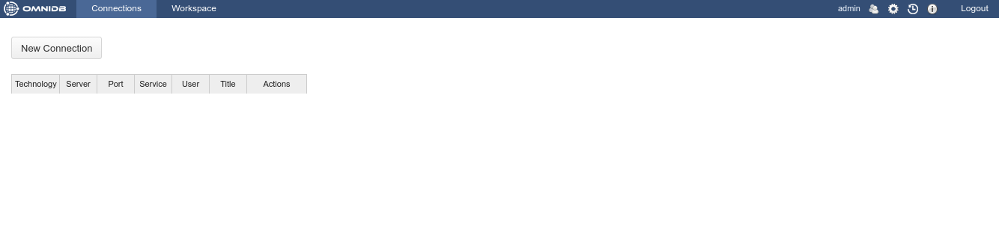
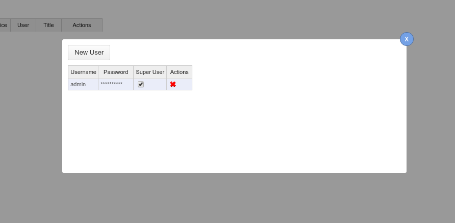
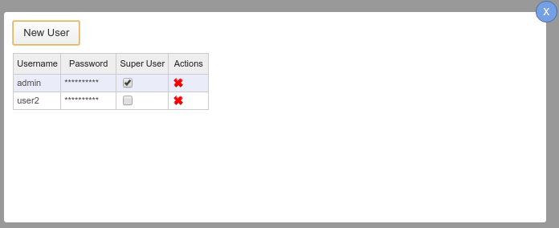
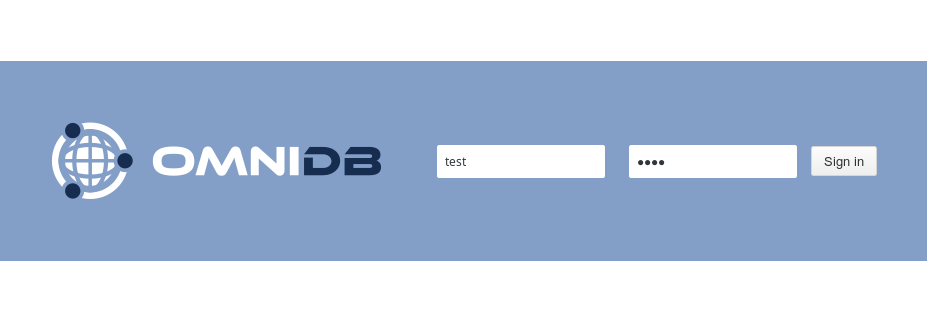
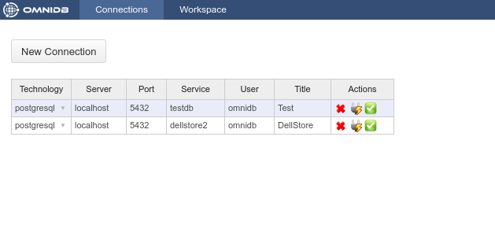
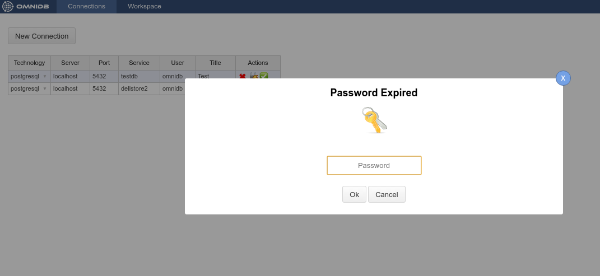
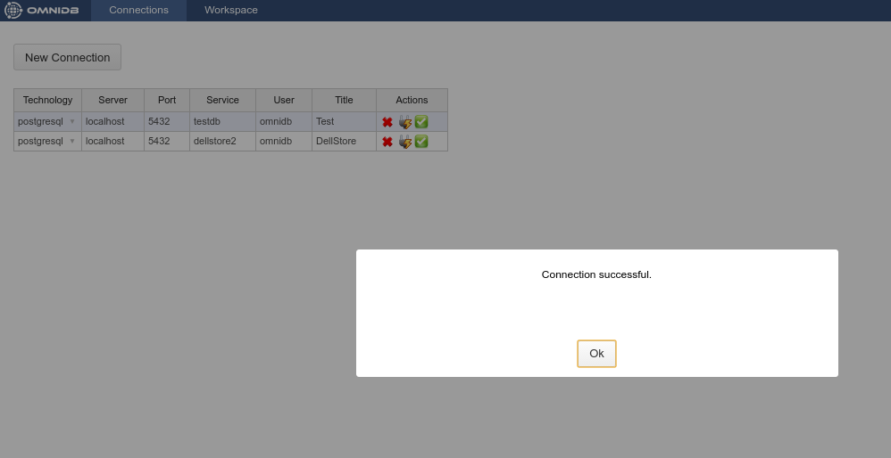

# Creating Users and Connections

## Logging in as user *admin*

OmniDB comes only with the user *admin*. If you are using the server version,
the first thing to do is sign in as *admin*, the default password is *admin*.
You don't need to login in the app version.

The next window is the **Connections** window. We will talk about it later.

## Creating another user

Click on the *Users* icon on the upper right corner. It will open a popup
that allows the current OmniDB super user to create a new OmniDB user.

After clicking on the *Users* icon the tool inserts a new user called *user2*
(if that is the first user after *admin*).

You will have to change the *username* and *password*. Check if you want this
new user to be a *super user*. This user management window is only seem by super
users. When you are done, click on the *Save Data* button inside the popup.

You can create as many users as you want, edit existing users and also delete
users by clicking on the red cross at the actions column. Now you can logout.

## Signing in as the new user

Let us sign in as the user we just created.

And we can see the **Connections** window again. Note that now there is no
*Users* icon, because the *test* user is not a super user.

## Creating connections

OmniDB C# version supported several DBMS. At the moment, OmniDB Python version,
or `OmniDB 2.0`, supports only PostgreSQL. More DBMS support is being added as
you read this.

We will now create two connections to PostgreSQL databases. To create the
connections you have to click on the button *New Connection* and then choose the
connection and fill the other fields. After filling all the fields for both
connections, click on the *Save Data* button.

For each connection there is an *Actions* column where you can delete, test and
select them. Go ahead and test one of the connections.

Notice the *Password Expired* pop-up. This is happening because OmniDB does not
store the database user password on disk. When the user types a password in this
popup, the password is encrypted and stored in memory.

After you type the password and hit *Enter*, if the connection to the database
is successful you will see a confirmation pop-up.

But, if you have trouble of any kind connecting to your PostgreSQL database,
the *Password Expired* popup will remain showing the error OmniDB got.

Also, in the connections grid, if you click on the *Select Connection* action,
OmniDB will open it in the **Workspace Window**.
