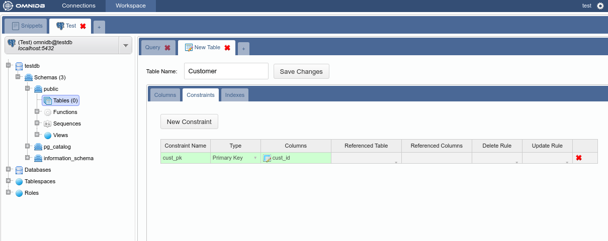
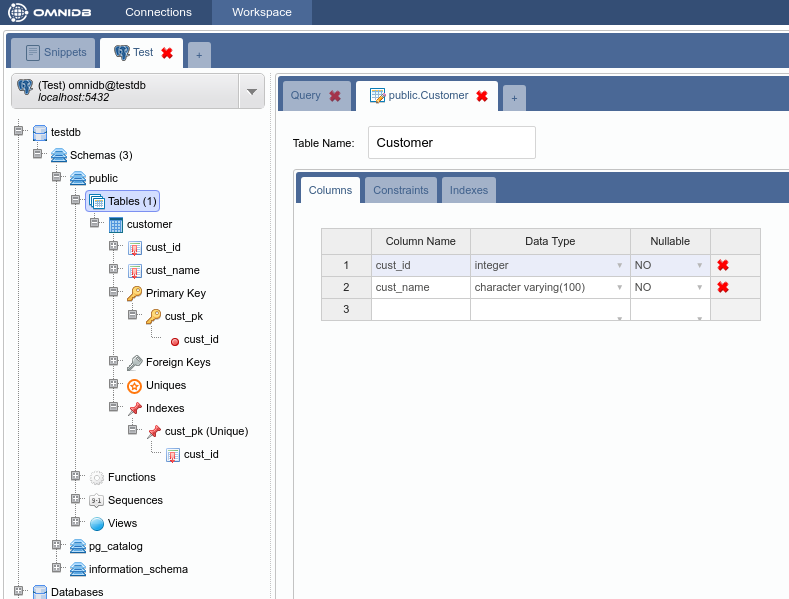
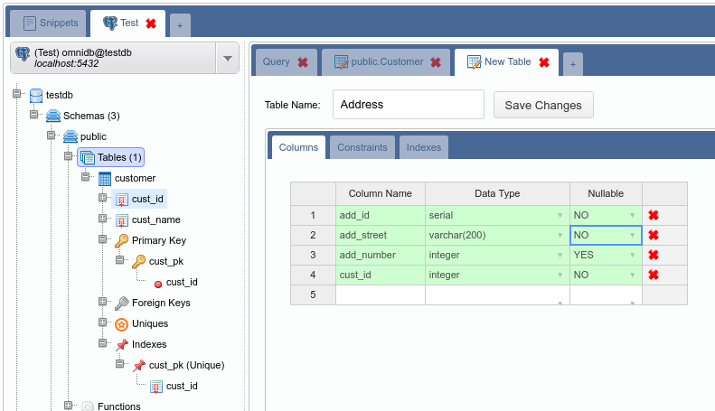
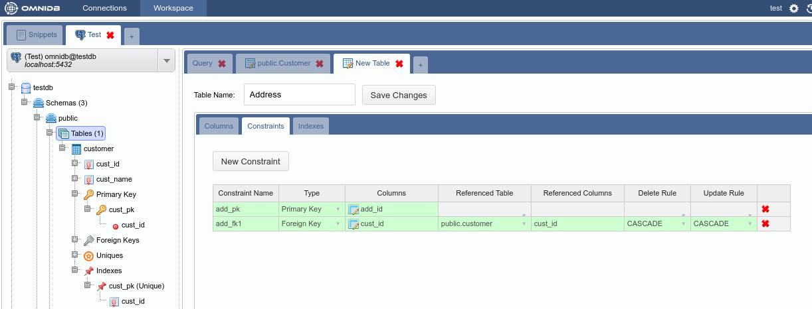
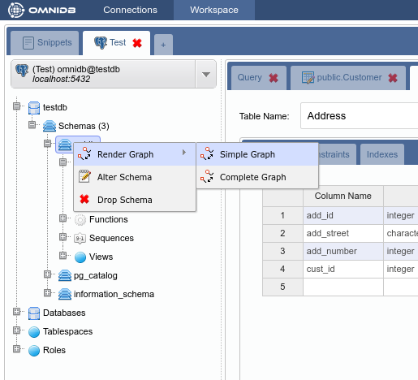
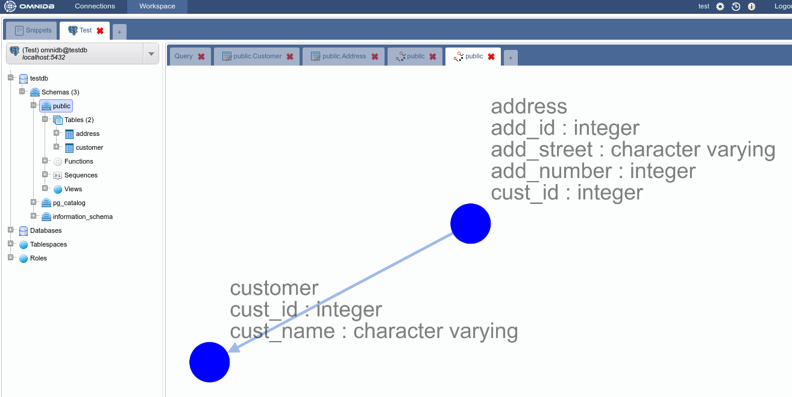
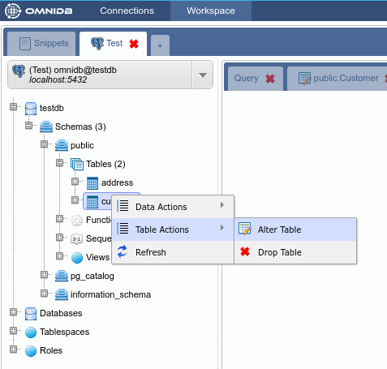
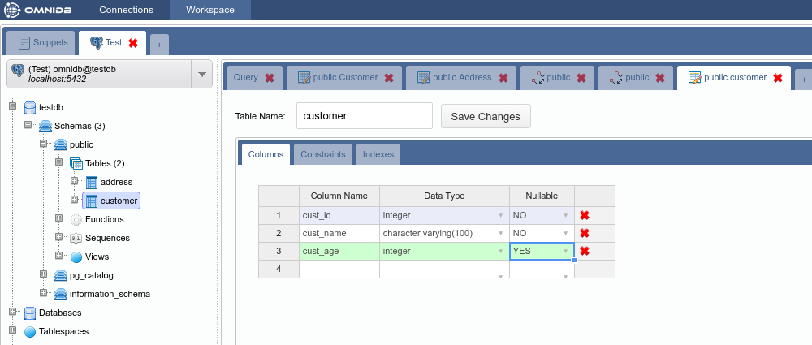
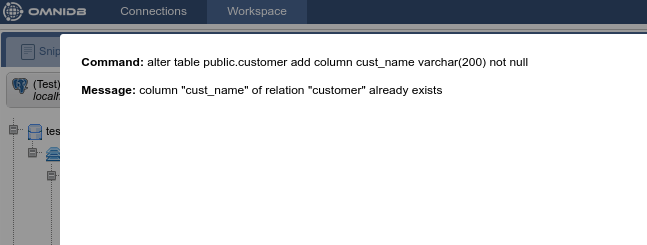

# Table Management

## Creating tables

OmniDB has a table creation interface that lets you configure columns,
constraints and indexes. A couple of observations should be mentioned:

- Most DBMS automatically create indexes when primary keys and unique
constraints are created. Because of that, the indexes tab is only available
after creating the table.
- Each DBMS has its unique characteristics and limitations regarding table
creation and the OmniDB interface reflects these limitations. For instance,
SQLite does not allow us to change existing columns and constraints. Because of
that, the interface lets us change only table name and add new columns when
dealing with SQLite databases (it is still not the case in OmniDB Python
version, as it currently supports only PostgreSQL databases).

We will create example tables (*Customer* and *Address*) in the `testdb`
database we connected to earlier. Right click on the **Tables** node and select
the **New Table** action:

We will create the table *Customer* with a primary key that will be referenced
by the table *Address*:

Note how the table appers in the *Tables* tree node:

Now create the table *Address* with a primary key and a foreign key:

At this point we have two tables in schema `public`. The schema structure can be
seen with the graph feature by right clicking on the schema `public` node of the
tree and selecting *Render Graph > Simple Graph*:

And this is what the *Complete Graph* looks like:

## Editing tables

OmniDB also lets you edit existing tables (always following DBMS limitations).
To test this feature we will add a new column to the table *Customer*. To access
the alter table interface just right click the table node and select the action
*Table Actions > Alter Table*:

Add the column *cust_age* and save:

The interface is capable of detecting errors that may occur during alter table
operations, showing the command and the error that occurred. To demonstrate it
we will try to add the column *cust_name*, which already belongs to this table:

## Removing tables

In order to remove a table just right click the table node and select the action
*Table Actions > Drop Table*:

