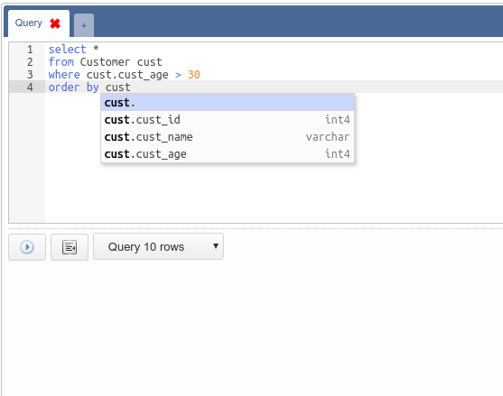
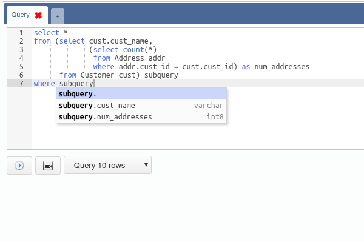
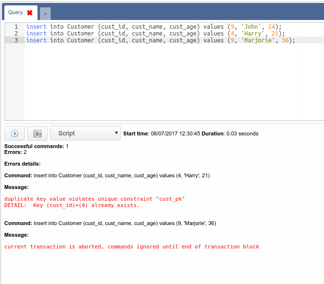
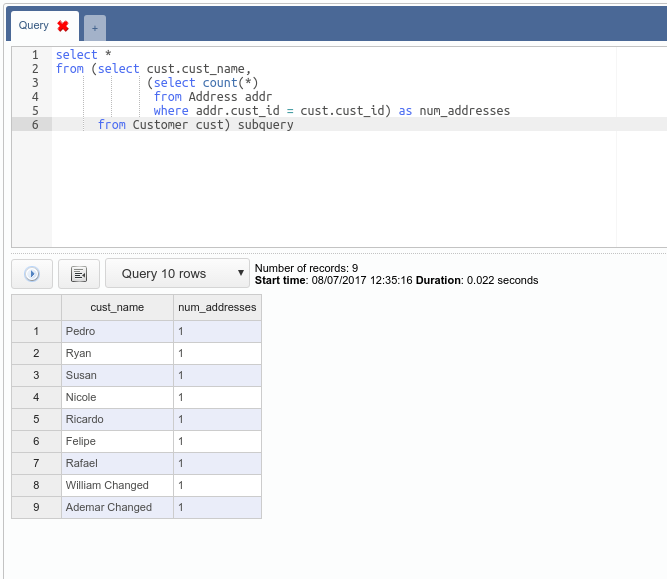

# Writing SQL Queries

The tool comes with a tab system where each tab contains a SQL editor, an action
button, an indent button, a field to select the type of command and a space to
display the result.

The SQL editor has a feature that helps a lot when creating new queries: SQL
code completion. With this feature it is possible to autocomplete columns
contained in a table referenced by an alias. To open the autocomplete interface
you just have to type the alias and then the dot character:

Besides autocompleting table columns the editor also searches for columns
contained in subqueries:

The field to select the type of command has the following options:

- **Script**: script execution, which is a sequence of commands separated by
semicolon:

The return shows the response time, the number of commands that were
successfully executed, the number of commands that generated errors and a list
displaying each error.

- **Execute**: execution of only one command. The return shows the response time
or an error.

- **Query (10, 100, 1000, all) rows**: execution of a query that returns a set
of records, which are displayed on a grid. Just like in the record editing
interface each cell can be visualized separately by right clicking it:

