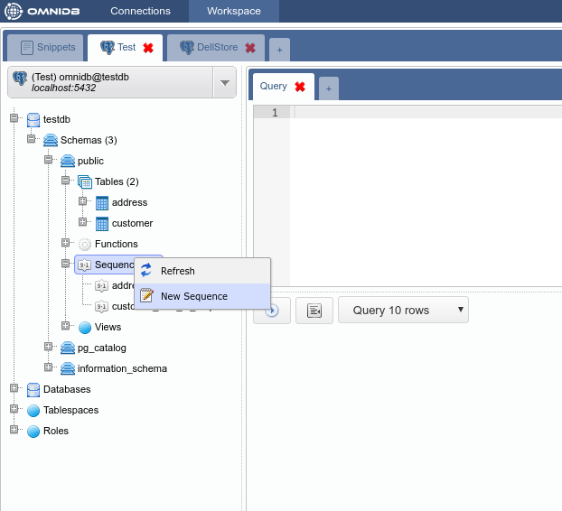
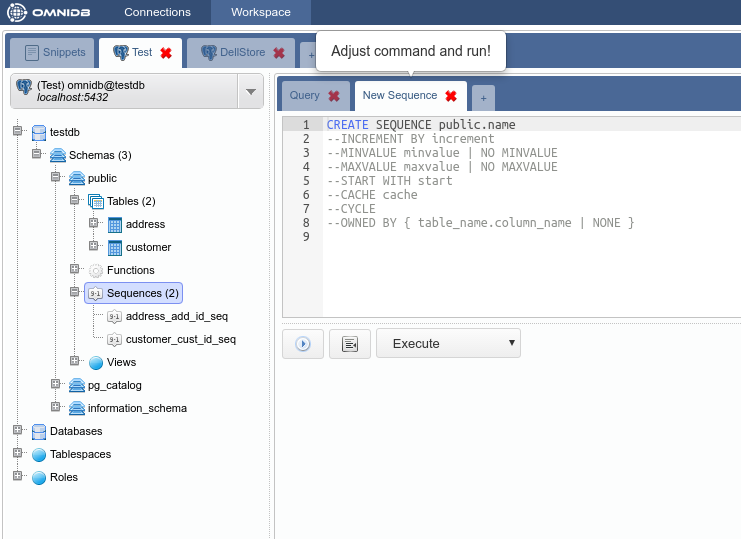
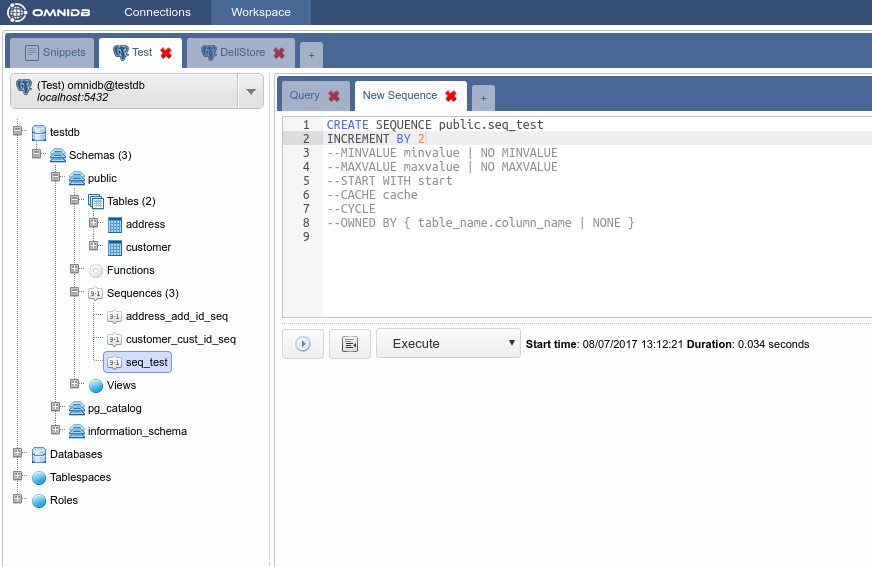
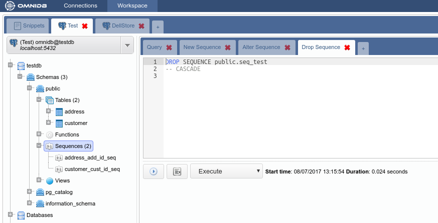

# Managing other PostgreSQL Elements

With the exception of tables, all PostgreSQL structures are possible to be
managed with the use of *SQL templates*. This gives the user more power than
using graphical forms to manipulate structures.

For example, let's consider the sequences inside the schema `public` of the
database `testdb`. To create a new sequence, right click on the *Sequences*
node, and choose *New Sequence*.

After you change the name of the sequence, you can uncomment other command
options and set them accordingly to your needs. When all the command looks fine,
you can click on the *Execute button* and the new sequence will be created:

With right click on an existing sequence, you can alter or drop it. It will work
the same way as the creation, by using a SQL template for the user to change.

