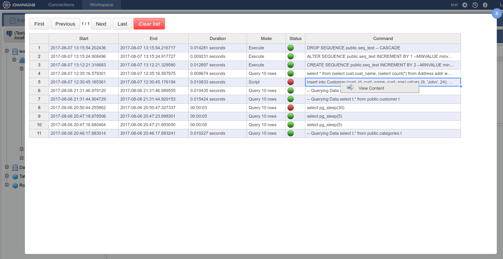
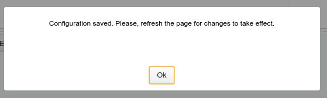
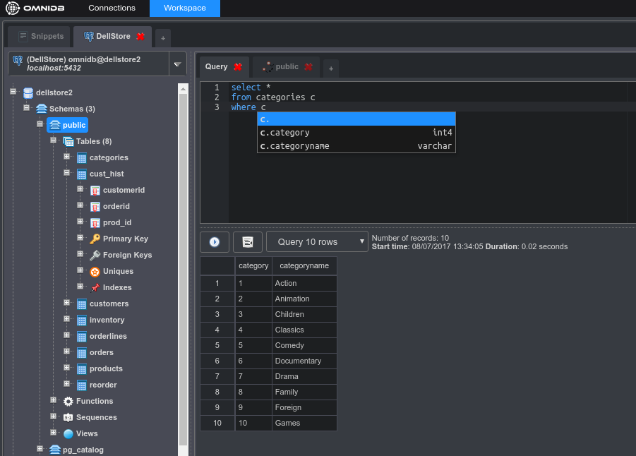

# Additional Features

## SQL History

Every interaction the user does with every database is logged in OmniDB's *SQL
History*. To access it you need to click on the clock-like icon on the upper
right corner. OmniDB will show a pop-up with all actions in a paginated grid.

Each action shows date time it started, the time it ended, the duration, the
mode, the status and the command. As every grid in OmniDB, you can right click
on the command and click *View Content*, where another pop-up will open showing
the content in a larger text editor.

## User Settings

Also in the upper right corner, by clicking in the gear-like icon, OmniDB will
open the *User Settings* pop-up. It is composed by two tabs:

- **User**: Allows the user to change its password. More user settings will be
added in future.

- **Editor**: Allows the user to change the font size of the SQL Editor, and
also change the entire OmniDB theme. There are a lot of OmniDB themes, each of
them change the syntax highlight color of the editor. They are also categorized
in light and dark themes. A light theme is the default; a dark theme will change
the entire interface of OmniDB.

Every change in user settings require that you either:

- Refresh the page, if you are using OmniDB server and the interface through a
web browser; or
- Open and close OmniDB, if you are using OmniDB app.

