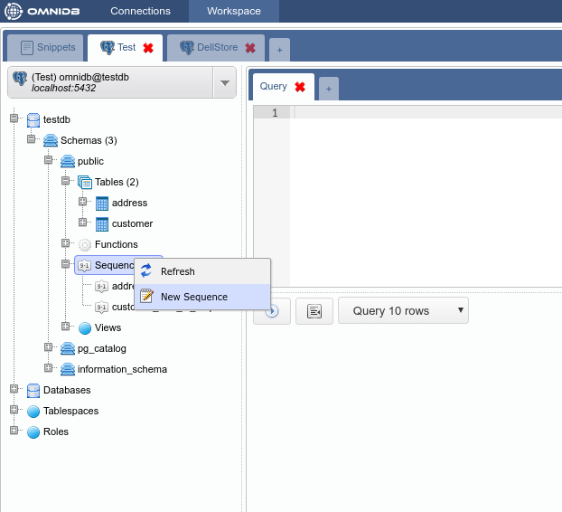
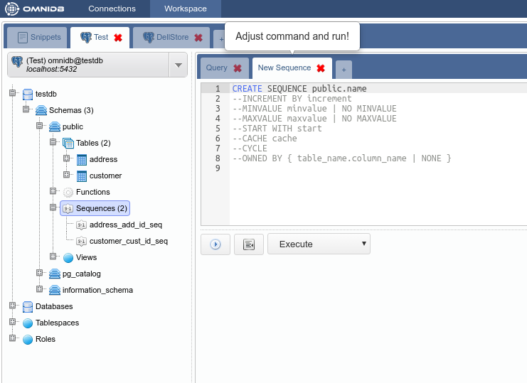
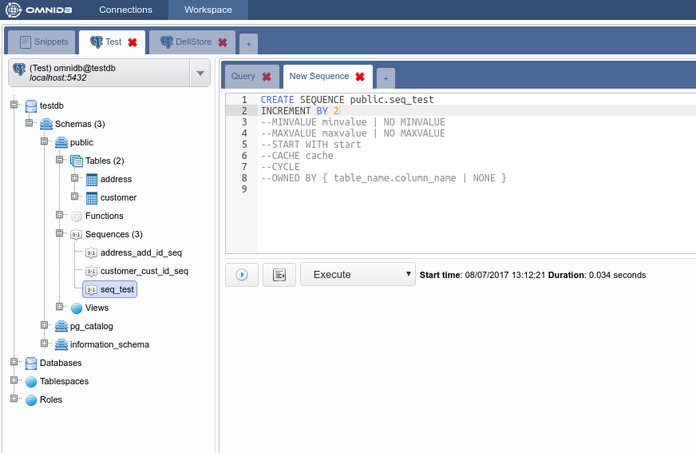
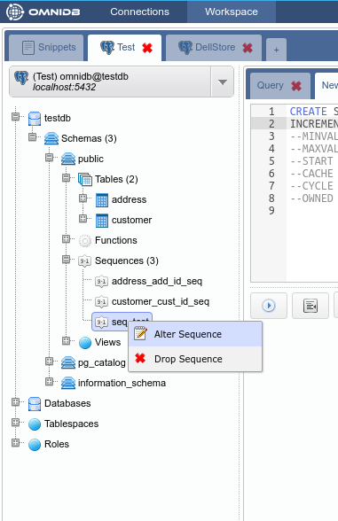
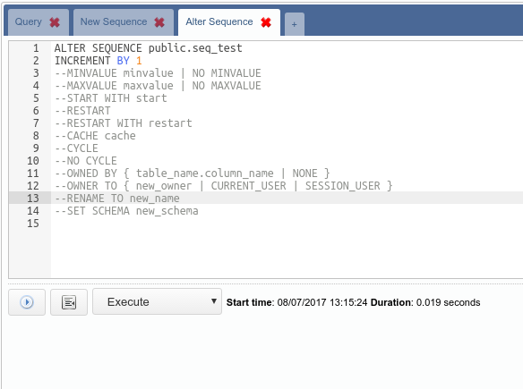
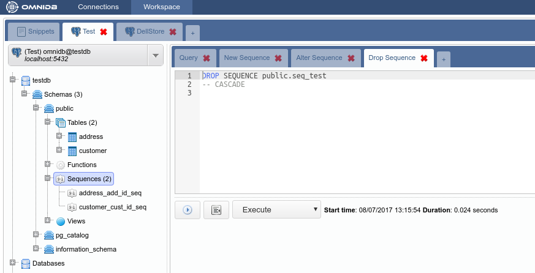

# Modelos SQL

Com exceção das tabelas, todas as estruturas do PostgreSQL podem ser gerenciadas com o uso de *modelos SQL*. Isso dá ao usuário mais poder do que usando formas gráficas para manipular estruturas.
Por exemplo, vamos considerar as sequências dentro do schema `public` do banco de dados `testdb`. Para criar uma nova seqüência, clique com o botão direito do mouse no nó *Sequences* e escolha *New Sequence*.

Depois de alterar o nome da sequência, você pode descomentar outras opções de comando e configura-las de acordo com suas necessidades. Quando todos os comandos estiverem corretos, você pode clicar no botão *Execute* e uma nova sequência será criada:

Com o clique direito em uma sequência existente, você pode alterá-la ou soltar. Será feito da mesma maneira que a criação, usando um modelo SQL para o usuário efetuar a mudança.

