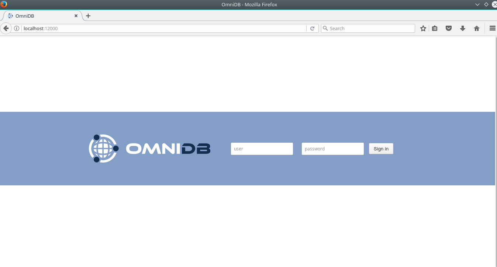

# Installation

In order to run OmniDB, you don't need to install any additional piece of
software. Just head to [omnidb.org](omnidb.org) and download the latest zip
package for your specific operating system and architecture:

- Linux 32 bits / 64 bits
- Windows 32 bits / 64 bits
- Mac OSX

Extract the zip file somewhere in your computer. It will create a folder called
`omnidb`. Get inside this folder and run the `omnidb` executable.

```bash
user@machine:~$ cd omnidb
user@machine:~/omnidb$ ./omnidb
Starting OmniDB at http://localhost:12000
Open OmniDB in your favorite browser
```

Now that the web server is running, you may access OmniDB web app on your
favorite browser. Type in address bar: `localhost:12000` and hit `Enter`. If
you are running in any port other than `12000`, utilize the appropriate port
number. If everything went fine, you shall see a page like this:



Now you know that OmniDB is running correctly. In the next chapters, we will see
how to login for the first time, how to create an user and to utilize OmniDB.
