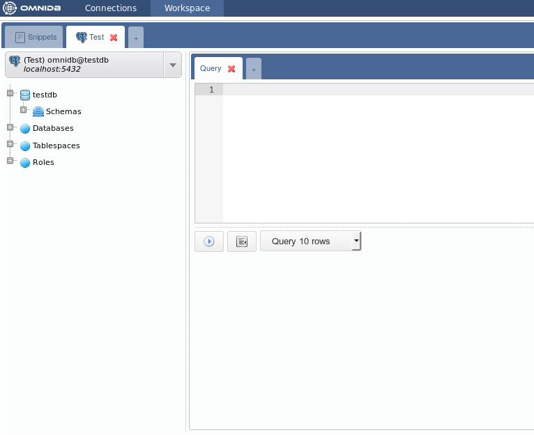

# Workspace

After creating at least one connection the user can enter the *Workspace*.

## Sections of the *Workspace* window

This interface has several elements:

- **1) Links**: Enables the user to navigate between OmniDB windows
- **2) Outer Tabs**: OmniDB lets you work with several databases at the same
time. Each database will be accessible through an *outer tab*. Outer tabs also
can host miscellaneous features, like the *Snippets* feature
- **3) Tree View**: Depending on the feature, the *tree view* can show different
kinds of elements arranged in a hierarchical tree
- **4) Options**: Shows the current user logged in, and also links for *user
settings*, *query history*, *information* and *logout*.
- **5) Inner Tabs**: For each *outer tab* you are working on at the moment, you
can open several *inner tabs* to perform several kinds of activities
- **6) Inner Tab Content**: The content of a *inner tab* can be an *editor* or
several kinds of forms
- **7) Inner Tab Actions and Results**: If the *inner tab* hosts and *editor*,
you may see different actions and results

## Connection Outer Tab

Notice the little tab with a cross besides the *Snippet Outer Tab*. This allows
you to create a new outer tab that will automatically be a *Connection Outer
Tab*. However, the *Snippet Outer Tab* is fixed and will always be the first.

Now create a new *Connection Outer Tab*.

A new *Connection Outer Tab* will always automatically point to the first
connection on your list of database connections. Observe the elements inside of
this tab:

- **1) Connection Selector**: Shows all connections and lets the user select the
current one
- **2) Tree of Structures**: Displays a hierarchical tree where you can navigate
through the database elements
- **3) Inner Tabs**: Allows the user to execute actions in the current database.
There are several kinds of inner tabs for the current database. By clicking on
the last small tab with a cross, you can add a new tab. A new tab always will be
a *Query Tab*, where you can write any kind of SQL statement
- **4) Inner Tab Content**: Can vary depending on the kind of inner tab. The
figure shows a *Query Tab* and in this case the content will be an *SQL
Editor*, with syntax highlight and autocomplete
- **5) Inner Tab Actions**: Can vary depending on the kind of inner tab. For a
*Query Tab*, they are *Execute Button*, *Format Button* and *Editor Mode*
(script, execute or query)
- **6) Inner Tab Results**: A *Query Tab* in query mode, after you click in the
*Execute Button* or type the execute shortcut (`Alt-Q`), will show a grid with
the query results. All modes will show error messages, if any.

## Working with databases

Take a look at your connections selector. OmniDB always points to the first
available connection but you can change it by clicking on the selector.

Select the *DellStore* connection. Now go to the tree right below the selector
and click to expand the node *Schemas*.

Bear in mind that every 10 minutes you keep without performing actions on the
database, will trigger a *Password Expired* popup. As explained before, this is
important for your database security. After you type the correct password, you
will see all schemas in your database (in case of PostgreSQL, `TOAST` and temp
schemas are not shown).

Now click to expand the schema `public`. You will see different kinds of
elements contained in this schema.

Now click to expand the node *Tables*, and you will see all tables contained in
the schema `public`. Expand any table and you will see its columns, primary key,
foreign keys, unique constraints and indexes. Each column is also expansible,
displaying data type and nullable constraint.

In order to view records inside a table, right click it and choose *Data Actions
> Query Data*.

Notice that OmniDB fills the current SQL editor with a simple query to list
table records. The records are displayed in a grid right below the editor. This
grid can be controlled with keyboard as if you were using a spreadsheet manager.
You can also copy data from single cells or block of cells (that can be selected
with the keyboard or mouse) and paste on any spreadsheet manager.

You can edit the query on the SQL editor, writing simple or more complex queries
and clicking on the action button. You can control how many records should be
displayed (10, 100, 1000 or all rows). More details in the next chapters.

## Working with multiple tabs inside the same connection

Inside a single connection, you can create several inner tabs by clicking on the
last little tab with a cross. Each new inner tab will be a *Query Tab*.

