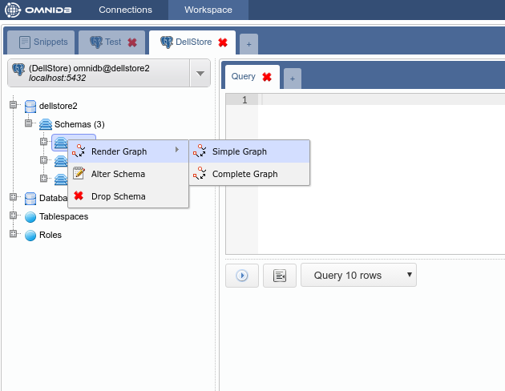
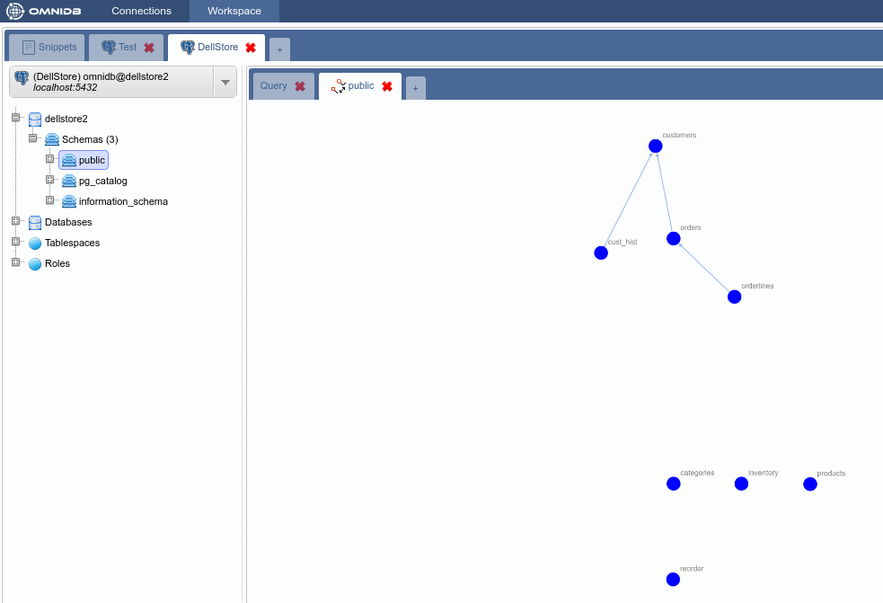
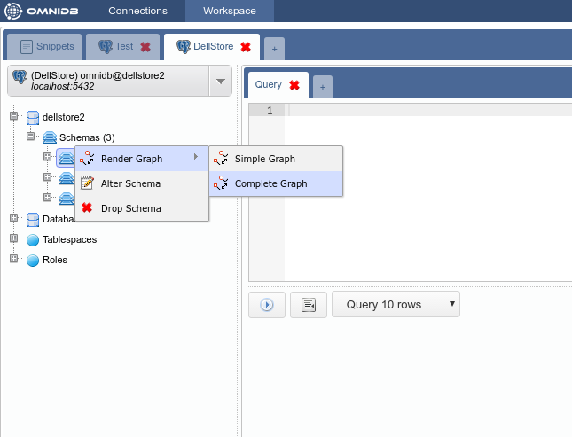
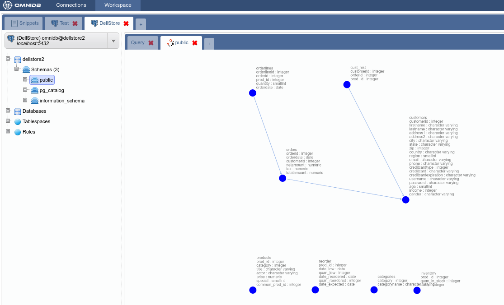

# Graph with Tables and Relations

This feature displays a graph with nodes representing tables and edges
representing table relationships with foreign keys. Using the mouse, the user is
able to zoom in, zoom out, and drag and drop nodes to change its position.

There are two types of graphs: *Simple Graph* and *Complete Graph*.

## Simple graph

To access it just right click the root node of the tree and then select the
action *Render Graph > Simple Graph*:

## Complete graph

This graph displays tables with all its columns and respective data types.
Additionally, edges now are labeled with information about the specific foreign
key. To access it just right click the root node of the tree and then select the
action *Render Graph > Complete Graph*:

