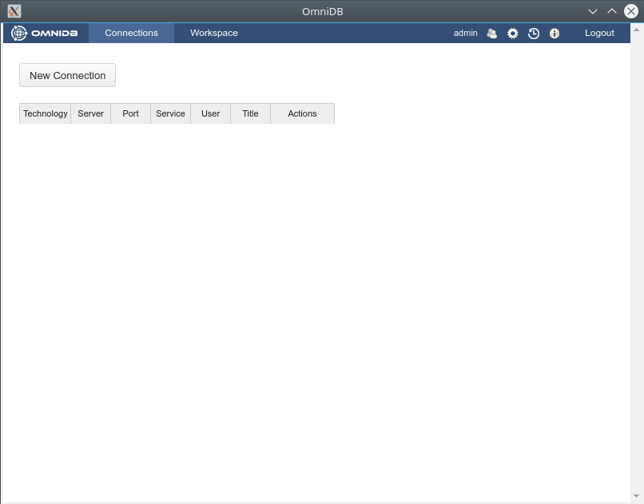
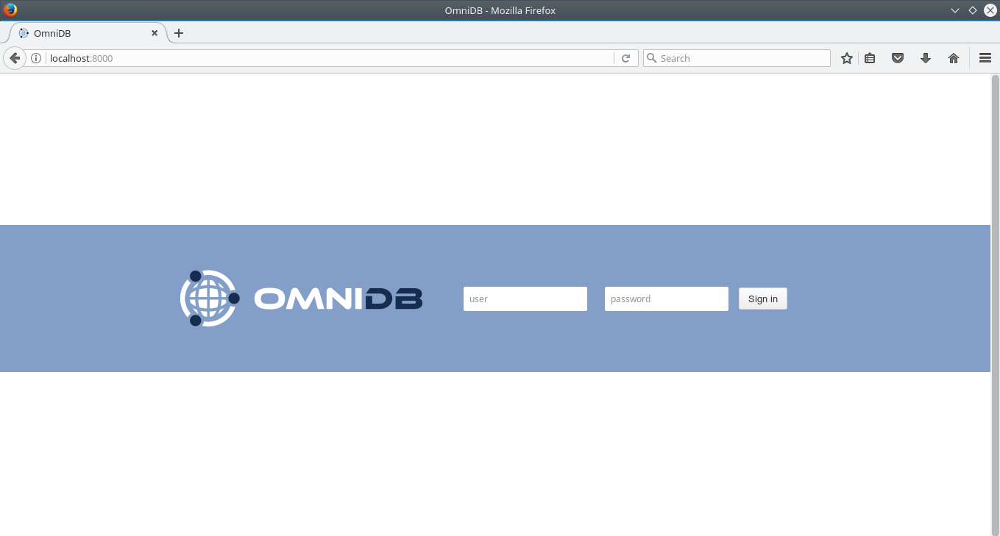

# Instalação

OmniDB fornece 2 tipos de pacotes para atender a todas as necessidades dos usuários:

- **OmniDB Application**: Executa um servidor web em uma porta aleatória para trás, e fornece uma janela simplificada do servidor web para usar a interface OmniDB sem qualquer configuração adicional. Funciona como uma aplicação de desktop.
- **OmniDB Server**: executa um servidor web em uma porta aleatória. O usuário necessita de um navegador Web para se conectar. Fornece gerenciamento de usuários e é ideal para ser hospedado em um servidor na rede dos usuários.

Tanto o OmniDB Application quanto o OmniDB Server podem ser instalados na mesma máquina.

## OmniDB Application

Para executar o aplicativo OmniDB, você não precisa instalar nenhuma peça adicional de software. Basta dirigir-se a [omnidb.org](omnidb.org) e baixar o pacote mais recente para seu sistema operacional específico e arquitetura:

	• Linux 32 bits / 64 bits
		- instalador DEB
		- instalador RPM
		- Tarball

	• Windows 32 bits / 64 bits
		- instalador EXE
		- pacote ZIP

	• Mac OS X
		- Instalador DMG
		- pacote ZIP

Se você escolhe pacotes tarball ou zip, basta extraí-lo em algum lugar do seu computador. Entre na pasta criada e abra o executável do `omnidb-app`. Ele abrirá OmniDB dentro de sua própria janela.

Com o instalador, você pode instalar o OmniDB no seu sistema, e estará disponível através do menu do seu aplicativo de ambiente de trabalho. Quando você abri-lo o OmniDB abrirá sua própria janela.




## OmniDB Server

Como o OmniDB app, o OmniDB Server não requer nenhuma peça adicional de software e as mesmas opções para sistema operacional e arquitetura são fornecidas.
Se você escolher o tarball ou o pacote zip, extraia-o em algum lugar do seu computador. Entre na pasta descompactada e abra o executável `omniDB-server`.

```bash
User@machine:~$ cd omnidb-server
User@machine:~ / omnidb-server$ ./omnidb
Iniciando o OmniDB 2.0.2 em http://localhost: 8000
Abra OmniDB no seu navegador favorito
Pressione Ctrl + C para sair
```

Para instalar o OmniDB Server, você precisará de privilégios de administrador:

```bash
User@machine:~ $ sudo omnidb-server
Iniciando o OmniDB 2.0.2 em http: // localhost: 8000
Abra OmniDB no seu navegador favorito
Pressione Ctrl + C para sair
```

Agora que o servidor web está em execução, você pode acessar o aplicativo da web OmniDB em seu navegador favorito. Digite na barra de endereços: `localhost: 8000` e tecle `Enter`.
Se tudo correu bem, você verá uma página como esta:




Agora você sabe que o OmniDB está funcionando corretamente. Nos próximos capítulos, nós veremos como fazer o login pela primeira vez, como criar um usuário e utilizar OmniDB.
