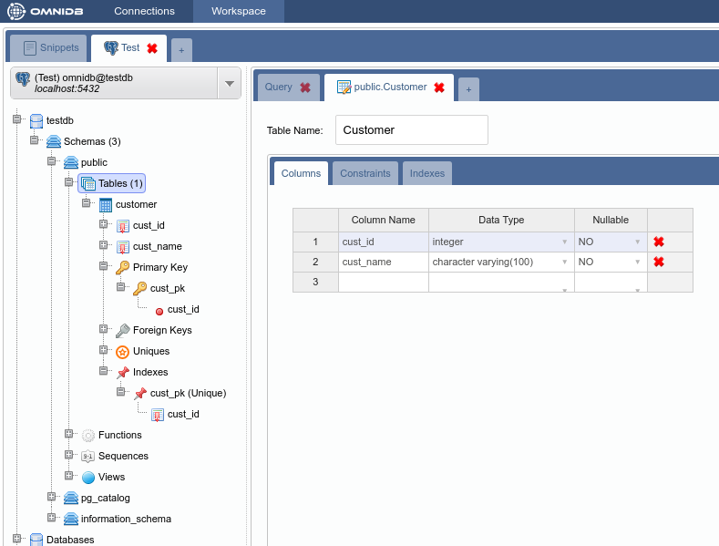
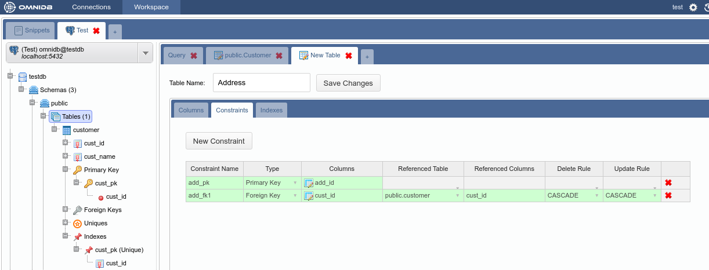
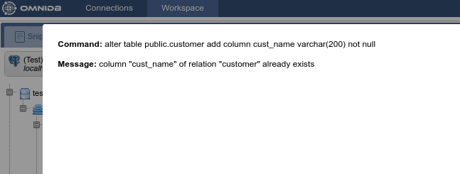
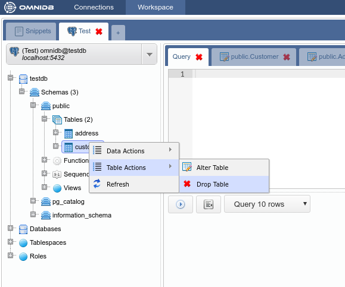

# Gerenciamento de tabela

## Criando tabelas

OmniDB possui uma interface de criação de tabelas que permite configurar colunas, restrições (constraints) e índices. Algumas observações devem ser mencionadas:
-	A maioria dos SGBDs cria automaticamente índices quando as chaves primárias e exclusivas são criadas. Por isso, a guia de índices só está disponível depois de criar a tabela.
-	Cada SGBD tem suas características e limitações únicas na criação de tabelas e a interface OmniDB reflete essas limitações. Por exemplo, o SQLite não nos permite alterar as colunas existentes e restrições (constraints). Por isso, a interface nos permite mudar apenas o nome da tabela e adicionar novas colunas ao lidar com bancos de dados SQLite (este ainda não é o caso da versão OmniDB Python, pois atualmente suporta apenas banco de dados PostgreSQL).

Vamos criar tabelas de exemplo (*Customer* e *Address*) no banco de dados `testdb` que conectamos anteriormente. Clique com o botão direito do mouse no nó **Tables** e selecione **New Table**:

Vamos criar a tabela *Customer* com uma chave primária que será referenciada pela Tabela *Address*:

Observe como a tabela aparece no nó *Tables* da árvore:

Agora, crie a tabela *Address* com uma chave primária e uma chave estrangeira.

Neste ponto, temos duas tabelas no schema `public`. A estrutura do schema pode ser vista com o recurso de gráfico clicando com o botão direito no schema `public` da árvore e selecionando *Render Graph > Simple Graph*:
At this point we have two tables in schema `public`. The schema structure can be
seen with the graph feature by right clicking on the schema `public` node of the
tree and selecting *Render Graph > Simple Graph*:

E é assim que o *Complete Graph* exibe:

## Editando tabelas

O OmniDB também permite que você edite tabelas existentes (sempre seguindo as limitações do SGBD). Para testar este recurso, adicionaremos uma nova coluna à tabela *Customer*. Para acessar a interface alter table apenas clique com o botão direito do mouse no nó da tabela e selecione *Table Actions > Alter Table*:

Adicione a coluna *cust_age* e salve:

A interface é capaz de detectar erros que podem ocorrer durante as operações Alter Table, mostrando o comando e o erro que ocorreu. Para demonstrar tentaremos adicionar a coluna *cust_name*, que já pertence a esta tabela:

## Removendo tabelas

Para remover uma tabela, clique com o botão direito do mouse no nó da tabela e selecione *Table Actions > Drop Table*:

