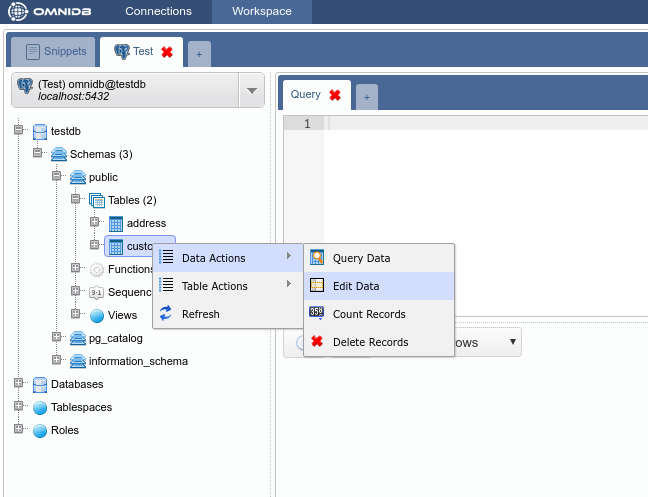
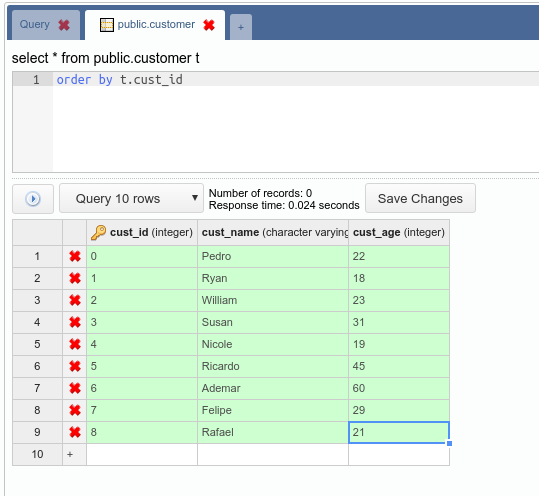
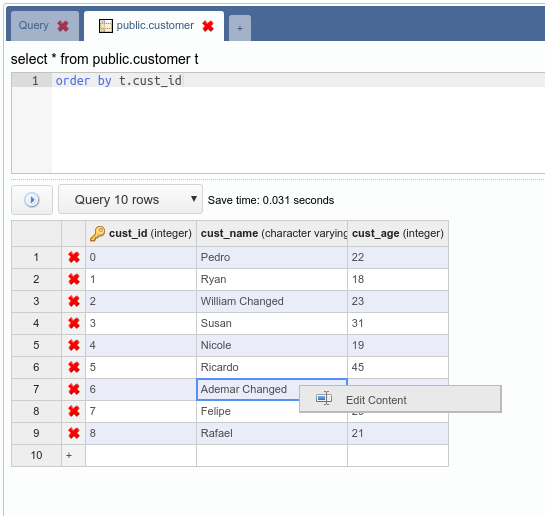
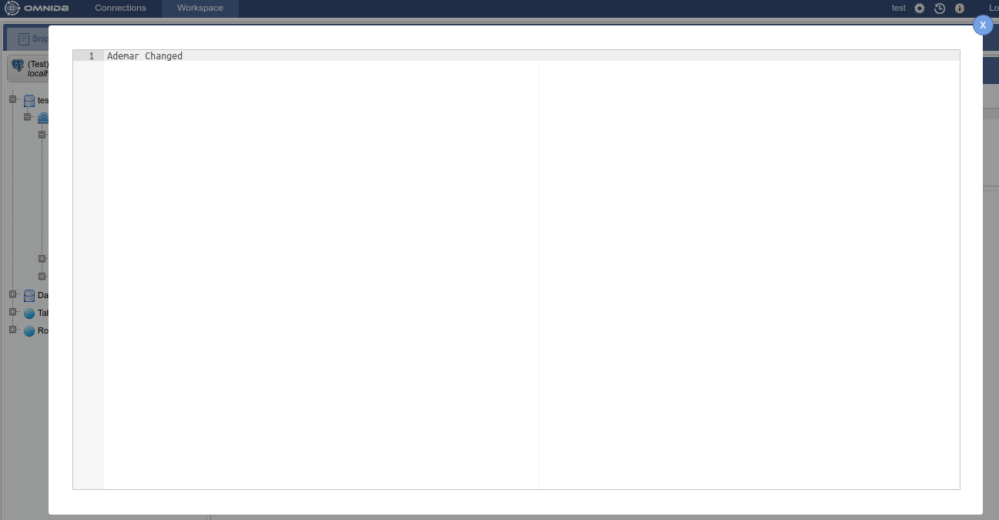

# Gerenciamento de dados

A ferramenta nos permite editar os registros contidos nas tabelas através de uma simples e intuitiva interface. Como apenas alguns SGBDs têm identificadores únicos para registros de tabelas, optamos por permitir a edição e remoção de dados apenas para tabelas que possuem chaves primárias. Tabelas que não o possuem podem receber apenas novas registros.

Para acessar a interface de edição de registro, clique com o botão direito do mouse no nó da tabela e selecione *Data Actions > Edit Data*:

A interface possui um editor SQL onde você pode filtrar e ordenar registros. Para evitar que a interface solicite muitos registros, há um campo que limita o número de registros a serem exibidos. A grade de registros tem as colunas  nomes e tipos de dados. Colunas que pertencem à chave primária têm um ícone de uma chave ao lado de seus nomes.

A linha da grade que tem o símbolo `*` é a linha para adicionar novos registros.
Vamos inserir alguns registros na tabela `Customer`:

Após salvar, os registros serão inseridos e podem ser editados (somente porque esta tabela possui uma chave primária). Vamos alterar o *cust_name* de alguns dos registros existentes:

As tabelas podem ter campos com valores representados por strings muito longas. Para editar estes campos, o OmniDB possui uma interface que pode ser acessada clicando na célula específica:

A interface detecta erros que podem ocorrer durante as operações relacionadas a registros. Para demonstrar, insira dois registros com `cust_id` (chave primária) existente:

Mostra quais comandos tentaram ser executados e os respectivos erros.
Para completar este capítulo, vamos adicionar alguns registros à tabela *Address*:

