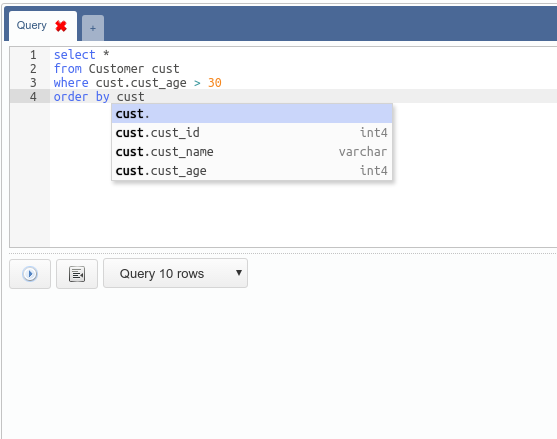
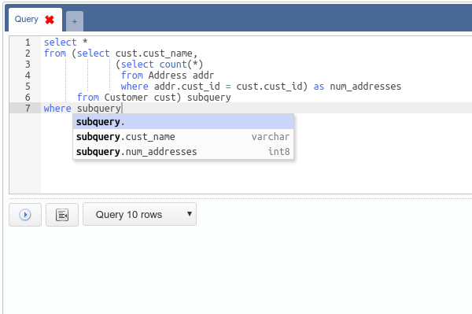
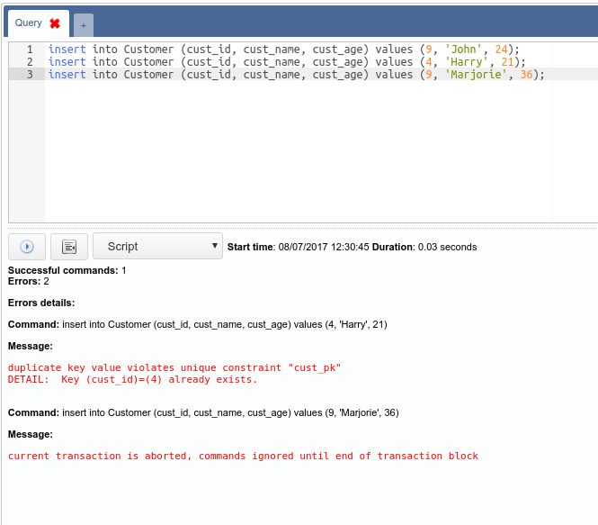
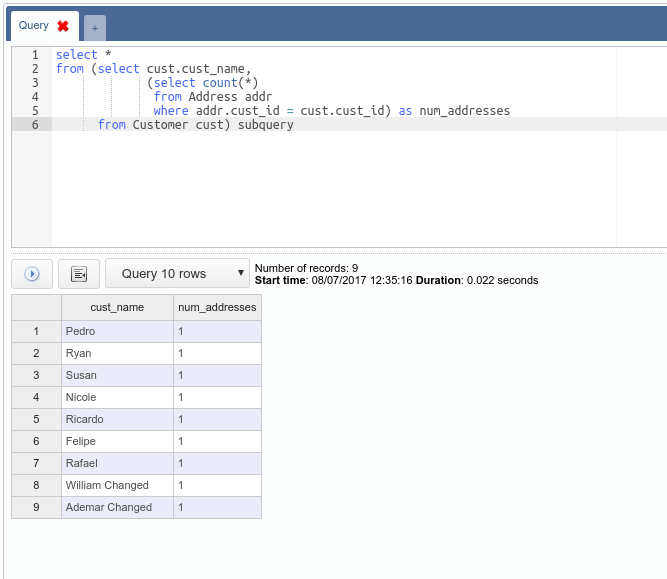

# Editor de SQL

A ferramenta vem com um sistema de tabulação onde cada guia contém um editor SQL, um botão de ação, um botão de recuo, um campo para selecionar o tipo de comando e um espaço para exibir o resultado.

O editor SQL possui um recurso que ajuda muito ao criar novas consultas: *SQL code completion*. Com esta funcionalidade, é possível preencher automaticamente colunas contidas em uma tabela referenciada por um Alias (apelido). Para abrir a interface de preenchimento automático você só precisa digitar o Alias (apelido) e, em seguida, o caractere de ponto ( . ):

Além de preencher automaticamente as colunas da tabela, o editor também procura colunas contidas em subquery (sub-consultas):

O campo para selecionar o tipo de comando possui as seguintes opções:
- **Script**: execução de script, que é uma sequência de comandos separados por ponto e vírgula ( ; ):

O retorno mostra o tempo de resposta, o número de comandos que foram executados com sucesso, o número de comandos que geraram erros e um lista mostrando cada erro.
-	**Execute**: execução de um único comando. O retorno mostra o tempo de resposta ou um erro.
-	**Query (10, 100, 1000, all) rows**: execução de uma consulta que retorna um conjunto de registros, que são exibidos em uma grade. Assim como na interface de edição de registro onde cada célula pode ser visualizada separadamente clicando com o botão direito do mouse:

